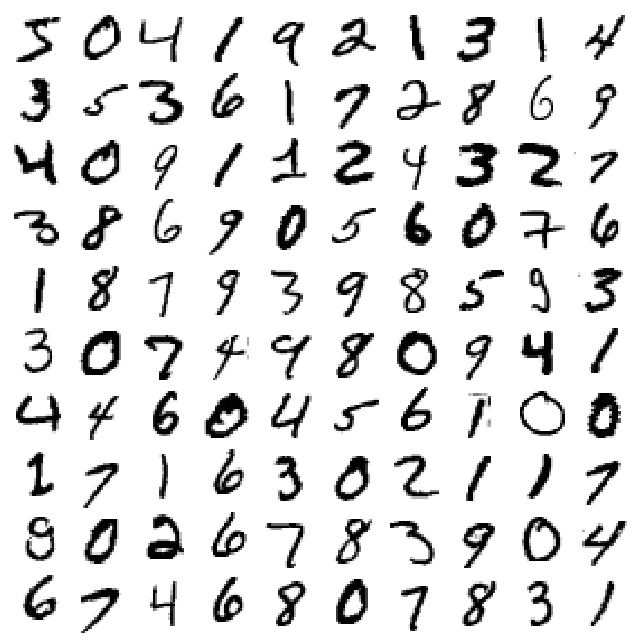
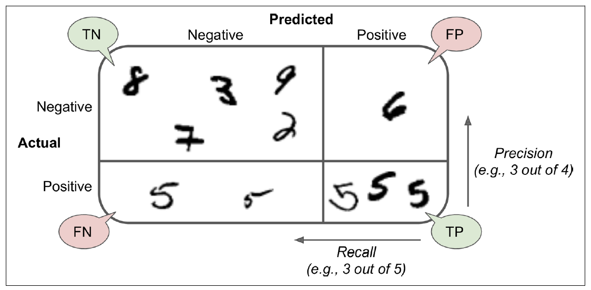
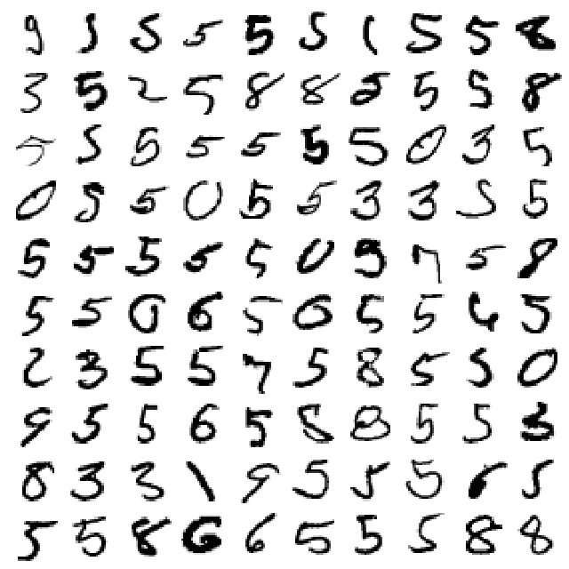
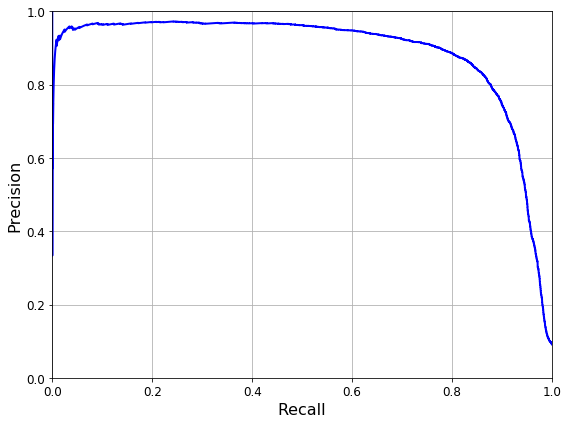
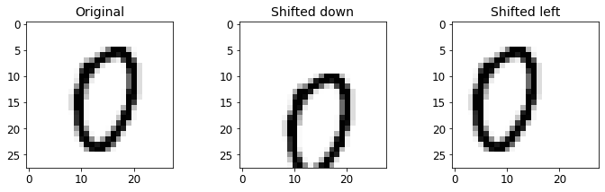

```python
# Python ≥3.5 is required
import sys
assert sys.version_info >= (3, 5)

# Scikit-Learn ≥0.20 is required
import sklearn
assert sklearn.__version__ >= "0.20"

# Common imports
import numpy as np
import os

# to make this notebook's output stable across runs
np.random.seed(42)

# To plot pretty figures
%matplotlib inline
import matplotlib as mpl
import matplotlib.pyplot as plt
mpl.rc('axes', labelsize=14)
mpl.rc('xtick', labelsize=12)
mpl.rc('ytick', labelsize=12)

# Where to save the figures
PROJECT_ROOT_DIR = "."
CHAPTER_ID = "classification"
IMAGES_PATH = os.path.join(PROJECT_ROOT_DIR, "images", CHAPTER_ID)
os.makedirs(IMAGES_PATH, exist_ok=True)

def save_fig(fig_id, tight_layout=True, fig_extension="png", resolution=300):
    path = os.path.join(IMAGES_PATH, fig_id + "." + fig_extension)
    print("Saving figure", fig_id)
    if tight_layout:
        plt.tight_layout()
    plt.savefig(path, format=fig_extension, dpi=resolution)
```

# MNIST 데이터


```python
from sklearn.datasets import fetch_openml
mnist = fetch_openml('mnist_784', version=1, cache=True)
mnist.keys()
```


    dict_keys(['data', 'target', 'feature_names', 'DESCR', 'details', 'categories', 'url'])


```python
X, y = mnist["data"], mnist["target"]
X.shape
```


    (70000, 784)


```python
X
```


    array([[0., 0., 0., ..., 0., 0., 0.],
           [0., 0., 0., ..., 0., 0., 0.],
           [0., 0., 0., ..., 0., 0., 0.],
           ...,
           [0., 0., 0., ..., 0., 0., 0.],
           [0., 0., 0., ..., 0., 0., 0.],
           [0., 0., 0., ..., 0., 0., 0.]])


```python
y
```


    array(['5', '0', '4', ..., '4', '5', '6'], dtype=object)


```python
%matplotlib inline
import matplotlib as mpl
import matplotlib.pyplot as plt

some_digit = X[2]
some_digit_image = some_digit.reshape(28, 28)
plt.imshow(some_digit_image, cmap=mpl.cm.binary)
plt.axis("off")

save_fig("some_digit_plot")
plt.show()
```

    Saving figure some_digit_plot


```python
some_digit
```


    array([  0.,   0.,   0.,   0.,   0.,   0.,   0.,   0.,   0.,   0.,   0.,
             0.,   0.,   0.,   0.,   0.,   0.,   0.,   0.,   0.,   0.,   0.,
             0.,   0.,   0.,   0.,   0.,   0.,   0.,   0.,   0.,   0.,   0.,
             0.,   0.,   0.,   0.,   0.,   0.,   0.,   0.,   0.,   0.,   0.,
             0.,   0.,   0.,   0.,   0.,   0.,   0.,   0.,   0.,   0.,   0.,
             0.,   0.,   0.,   0.,   0.,   0.,   0.,   0.,   0.,   0.,   0.,
             0.,   0.,   0.,   0.,   0.,   0.,   0.,   0.,   0.,   0.,   0.,
             0.,   0.,   0.,   0.,   0.,   0.,   0.,   0.,   0.,   0.,   0.,
             0.,   0.,   0.,   0.,   0.,   0.,   0.,   0.,   0.,   0.,   0.,
             0.,   0.,   0.,   0.,   0.,   0.,   0.,   0.,   0.,   0.,   0.,
             0.,   0.,   0.,   0.,   0.,   0.,   0.,   0.,   0.,   0.,   0.,
             0.,   0.,   0.,   0.,   0.,   0.,   0.,   0.,   0.,   0.,   0.,
             0.,   0.,   0.,   0.,   0.,   0.,   0.,   0.,   0.,   0.,   0.,
             0.,   0.,   0.,   0.,   0.,   0.,   0.,   0.,   0.,   0.,   0.,
             0.,   0.,   0.,   0.,   0.,   0.,  67., 232.,  39.,   0.,   0.,
             0.,   0.,   0.,   0.,   0.,   0.,   0.,  62.,  81.,   0.,   0.,
             0.,   0.,   0.,   0.,   0.,   0.,   0.,   0.,   0.,   0.,   0.,
             0., 120., 180.,  39.,   0.,   0.,   0.,   0.,   0.,   0.,   0.,
             0.,   0., 126., 163.,   0.,   0.,   0.,   0.,   0.,   0.,   0.,
             0.,   0.,   0.,   0.,   0.,   0.,   2., 153., 210.,  40.,   0.,
             0.,   0.,   0.,   0.,   0.,   0.,   0.,   0., 220., 163.,   0.,
             0.,   0.,   0.,   0.,   0.,   0.,   0.,   0.,   0.,   0.,   0.,
             0.,  27., 254., 162.,   0.,   0.,   0.,   0.,   0.,   0.,   0.,
             0.,   0.,   0., 222., 163.,   0.,   0.,   0.,   0.,   0.,   0.,
             0.,   0.,   0.,   0.,   0.,   0.,   0., 183., 254., 125.,   0.,
             0.,   0.,   0.,   0.,   0.,   0.,   0.,   0.,  46., 245., 163.,
             0.,   0.,   0.,   0.,   0.,   0.,   0.,   0.,   0.,   0.,   0.,
             0.,   0., 198., 254.,  56.,   0.,   0.,   0.,   0.,   0.,   0.,
             0.,   0.,   0., 120., 254., 163.,   0.,   0.,   0.,   0.,   0.,
             0.,   0.,   0.,   0.,   0.,   0.,   0.,  23., 231., 254.,  29.,
             0.,   0.,   0.,   0.,   0.,   0.,   0.,   0.,   0., 159., 254.,
           120.,   0.,   0.,   0.,   0.,   0.,   0.,   0.,   0.,   0.,   0.,
             0.,   0., 163., 254., 216.,  16.,   0.,   0.,   0.,   0.,   0.,
             0.,   0.,   0.,   0., 159., 254.,  67.,   0.,   0.,   0.,   0.,
             0.,   0.,   0.,   0.,   0.,  14.,  86., 178., 248., 254.,  91.,
             0.,   0.,   0.,   0.,   0.,   0.,   0.,   0.,   0.,   0., 159.,
           254.,  85.,   0.,   0.,   0.,  47.,  49., 116., 144., 150., 241.,
           243., 234., 179., 241., 252.,  40.,   0.,   0.,   0.,   0.,   0.,
             0.,   0.,   0.,   0.,   0., 150., 253., 237., 207., 207., 207.,
           253., 254., 250., 240., 198., 143.,  91.,  28.,   5., 233., 250.,
             0.,   0.,   0.,   0.,   0.,   0.,   0.,   0.,   0.,   0.,   0.,
             0., 119., 177., 177., 177., 177., 177.,  98.,  56.,   0.,   0.,
             0.,   0.,   0., 102., 254., 220.,   0.,   0.,   0.,   0.,   0.,
             0.,   0.,   0.,   0.,   0.,   0.,   0.,   0.,   0.,   0.,   0.,
             0.,   0.,   0.,   0.,   0.,   0.,   0.,   0.,   0., 169., 254.,
           137.,   0.,   0.,   0.,   0.,   0.,   0.,   0.,   0.,   0.,   0.,
             0.,   0.,   0.,   0.,   0.,   0.,   0.,   0.,   0.,   0.,   0.,
             0.,   0.,   0.,   0., 169., 254.,  57.,   0.,   0.,   0.,   0.,
             0.,   0.,   0.,   0.,   0.,   0.,   0.,   0.,   0.,   0.,   0.,
             0.,   0.,   0.,   0.,   0.,   0.,   0.,   0.,   0.,   0., 169.,
           254.,  57.,   0.,   0.,   0.,   0.,   0.,   0.,   0.,   0.,   0.,
             0.,   0.,   0.,   0.,   0.,   0.,   0.,   0.,   0.,   0.,   0.,
             0.,   0.,   0.,   0.,   0., 169., 255.,  94.,   0.,   0.,   0.,
             0.,   0.,   0.,   0.,   0.,   0.,   0.,   0.,   0.,   0.,   0.,
             0.,   0.,   0.,   0.,   0.,   0.,   0.,   0.,   0.,   0.,   0.,
           169., 254.,  96.,   0.,   0.,   0.,   0.,   0.,   0.,   0.,   0.,
             0.,   0.,   0.,   0.,   0.,   0.,   0.,   0.,   0.,   0.,   0.,
             0.,   0.,   0.,   0.,   0.,   0., 169., 254., 153.,   0.,   0.,
             0.,   0.,   0.,   0.,   0.,   0.,   0.,   0.,   0.,   0.,   0.,
             0.,   0.,   0.,   0.,   0.,   0.,   0.,   0.,   0.,   0.,   0.,
             0., 169., 255., 153.,   0.,   0.,   0.,   0.,   0.,   0.,   0.,
             0.,   0.,   0.,   0.,   0.,   0.,   0.,   0.,   0.,   0.,   0.,
             0.,   0.,   0.,   0.,   0.,   0.,   0.,  96., 254., 153.,   0.,
             0.,   0.,   0.,   0.,   0.,   0.,   0.,   0.,   0.,   0.,   0.,
             0.,   0.,   0.,   0.,   0.,   0.,   0.,   0.,   0.,   0.,   0.,
             0.,   0.,   0.,   0.,   0.,   0.,   0.,   0.,   0.,   0.,   0.,
             0.,   0.,   0.,   0.,   0.,   0.,   0.,   0.,   0.,   0.,   0.,
             0.,   0.,   0.,   0.,   0.,   0.,   0.,   0.,   0.,   0.,   0.,
             0.,   0.,   0.,   0.,   0.,   0.,   0.,   0.,   0.,   0.,   0.,
             0.,   0.,   0.,   0.,   0.,   0.,   0.,   0.,   0.,   0.,   0.,
             0.,   0.,   0.,   0.,   0.,   0.,   0.,   0.,   0.,   0.,   0.,
             0.,   0.,   0.])


```python
y = y.astype(np.uint8)
```


```python
y
```


    array([5, 0, 4, ..., 4, 5, 6], dtype=uint8)


```python
def plot_digit(data):
    image = data.reshape(28, 28)
    plt.imshow(image, cmap = mpl.cm.binary,
               interpolation="nearest")
    plt.axis("off")
```


```python
def plot_digits(instances, images_per_row=10, **options):
    size = 28
    images_per_row = min(len(instances), images_per_row)
    images = [instance.reshape(size,size) for instance in instances]
    n_rows = (len(instances) - 1) // images_per_row + 1
    row_images = []
    n_empty = n_rows * images_per_row - len(instances)
    images.append(np.zeros((size, size * n_empty)))
    for row in range(n_rows):
        rimages = images[row * images_per_row : (row + 1) * images_per_row]
        row_images.append(np.concatenate(rimages, axis=1))
    image = np.concatenate(row_images, axis=0)
    plt.imshow(image, cmap = mpl.cm.binary, **options)
    plt.axis("off")
```


```python
plt.figure(figsize=(9,9))
example_images = X[:100]
plot_digits(example_images, images_per_row=10)
save_fig("more_digits_plot")
plt.show()
```

    Saving figure more_digits_plot





```python
y[0]
```


    5


```python
X_train, X_test, y_train, y_test = X[:60000], X[60000:], y[:60000], y[60000:]
```

# 이진분류기 (Binary classifier)

문제를 단순화해서 숫자 5만 식별해보자.


```python
y_train_5 = (y_train == 5)
y_test_5 = (y_test == 5)
```


```python
y_train_5
```


    array([ True, False, False, ...,  True, False, False])


로지스틱 회귀 모델을 사용해보자.


```python
from sklearn.linear_model import LogisticRegression
log_clf = LogisticRegression(random_state=0).fit(X_train, y_train_5)
```

    /Users/sumin/opt/anaconda3/lib/python3.7/site-packages/sklearn/linear_model/logistic.py:432: FutureWarning: Default solver will be changed to 'lbfgs' in 0.22. Specify a solver to silence this warning.
      FutureWarning)


```python
log_clf.predict([X[0],X[1],X[2]])
```


    array([ True, False, False])


교차 검증을 사용해서 평가해보자.


```python
from sklearn.model_selection import cross_val_score
cross_val_score(log_clf, X_train, y_train_5, cv=3, scoring="accuracy")
```

    /Users/sumin/opt/anaconda3/lib/python3.7/site-packages/sklearn/linear_model/logistic.py:432: FutureWarning: Default solver will be changed to 'lbfgs' in 0.22. Specify a solver to silence this warning.
      FutureWarning)
    /Users/sumin/opt/anaconda3/lib/python3.7/site-packages/sklearn/linear_model/logistic.py:432: FutureWarning: Default solver will be changed to 'lbfgs' in 0.22. Specify a solver to silence this warning.
      FutureWarning)
    /Users/sumin/opt/anaconda3/lib/python3.7/site-packages/sklearn/linear_model/logistic.py:432: FutureWarning: Default solver will be changed to 'lbfgs' in 0.22. Specify a solver to silence this warning.
      FutureWarning)


    array([0.9737 , 0.97145, 0.97275])


모든 교차 검증 폴드에 대해 정확도가 97% 이상임. 모델이 좋아 보이는가?


```python
from sklearn.base import BaseEstimator
class Never5Classifier(BaseEstimator):
    def fit(self, X, y=None):
        pass
    def predict(self, X):
        return np.zeros(len(X), dtype=bool)
```


```python
never_5_clf = Never5Classifier()
cross_val_score(never_5_clf, X_train, y_train_5, cv=3, scoring="accuracy")
```


    array([0.91125, 0.90855, 0.90915])


```python
never_5_clf.predict(X)
```


    array([False, False, False, ..., False, False, False])


이미지의 10%만 숫자 5이기 때문에 무조건 5가 아닌 것으로 예측하면 정확도는 90%가 된다. 목표값(클래스)들이 불균형인 경우에 정확도(accuracy)는 좋은 지표가 아니다.

### 오차행렬 (Confusion matrix)


```python
from sklearn.model_selection import cross_val_predict

y_train_pred = cross_val_predict(log_clf, X_train, y_train_5, cv=3)
```

    /Users/sumin/opt/anaconda3/lib/python3.7/site-packages/sklearn/linear_model/logistic.py:432: FutureWarning: Default solver will be changed to 'lbfgs' in 0.22. Specify a solver to silence this warning.
      FutureWarning)
    /Users/sumin/opt/anaconda3/lib/python3.7/site-packages/sklearn/linear_model/logistic.py:432: FutureWarning: Default solver will be changed to 'lbfgs' in 0.22. Specify a solver to silence this warning.
      FutureWarning)
    /Users/sumin/opt/anaconda3/lib/python3.7/site-packages/sklearn/linear_model/logistic.py:432: FutureWarning: Default solver will be changed to 'lbfgs' in 0.22. Specify a solver to silence this warning.
      FutureWarning)


```python
y_train_pred.shape
```


    (60000,)


```python
from sklearn.metrics import confusion_matrix

confusion_matrix(y_train_5, y_train_pred)
```


    array([[53961,   618],
           [ 1024,  4397]])


<div>

</div>

### precision = $\frac{TP}{TP+FP}$ (정밀도)

### recall = $\frac{TP}{TP+FN}$ (재현율)


```python
from sklearn.metrics import precision_score, recall_score

precision_score(y_train_5, y_train_pred)
```


    0.8767696909272183


```python
4395/(4395+541)
```


    0.8903970826580226


```python
recall_score(y_train_5, y_train_pred)
```


    0.8111049621840989


```python
4395/(4395+1026)
```


    0.8107360265633647


```python
confusion_matrix(y_train_5, never_5_clf.predict(X)[:60000])
```


    array([[54579,     0],
           [ 5421,     0]])


```python
precision_score(y_train_5, never_5_clf.predict(X)[:60000])
```

    /Users/sumin/opt/anaconda3/lib/python3.7/site-packages/sklearn/metrics/classification.py:1437: UndefinedMetricWarning: Precision is ill-defined and being set to 0.0 due to no predicted samples.
      'precision', 'predicted', average, warn_for)


    0.0


```python
recall_score(y_train_5, never_5_clf.predict(X)[:60000])
```


    0.0


##  Error cases 조사하기


```python
errors = (y_train_pred != y_train_5)
```


```python
errors
```


    array([False, False, False, ..., False, False, False])


```python
plt.figure(figsize=(9,9))
plot_digits(X_train[errors][:100], images_per_row=10)

save_fig("more_digits_plot")
plt.show()
```

    Saving figure more_digits_plot





## Precision/Recall Trade-off


```python
for i in range(len(errors)):
    if errors[i]:
        print(i)
```

    48
    132
    138
    173
    244
    278
    470
    504
    512
    528
    540
    554
    558
    610
    615
    627
    635
    690
    748
    769
    778
    832
    836
    879
    899
    916
    924
    1015
    1021
    1024
    1029
    1032
    1089
    1102
    1104
    1111
    1145
    1151
    1222
    1278
    1298
    1311
    1324
    1325
    1328
    1346
    1356
    1376
    1433
    1453
    1468
    1587
    1682
    1784
    1806
    1930
    2000
    2028
    2148
    2172
    2184
    2207
    2209
    2211
    2213
    2272
    2302
    2308
    2368
    2373
    2385
    2395
    2428
    2486
    2566
    2622
    2636
    2744
    2758
    2803
    2958
    3013
    3034
    3070
    3095
    3204
    3205
    3216
    3268
    3289
    3401
    3416
    3502
    3524
    3537
    3580
    3638
    3648
    3872
    3918
    3969
    4004
    4066
    4184
    4192
    4205
    4231
    4304
    4416
    4475
    4562
    4596
    4645
    4665
    4666
    4786
    4801
    4820
    4908
    4958
    5066
    5080
    5157
    5177
    5188
    5250
    5255
    5303
    5309
    5382
    5414
    5506
    5526
    5554
    5632
    5666
    5678
    5737
    5738
    5752
    5757
    5771
    5798
    5839
    5847
    5857
    5904
    5925
    5947
    5956
    6066
    6096
    6171
    6236
    6264
    6370
    6418
    6450
    6472
    6504
    6636
    6644
    6735
    6836
    6844
    6848
    6895
    6920
    6929
    6943
    7032
    7044
    7068
    7080
    7112
    7134
    7226
    7232
    7270
    7276
    7281
    7286
    7323
    7346
    7354
    7368
    7498
    7544
    7546
    7584
    7639
    7833
    7842
    7865
    7871
    7884
    7907
    7917
    7962
    8009
    8062
    8190
    8307
    8339
    8414
    8419
    8435
    8488
    8504
    8549
    8623
    8624
    8639
    8662
    8678
    8712
    8713
    8728
    8731
    8757
    8814
    8816
    8898
    8940
    9084
    9146
    9340
    9344
    9376
    9378
    9384
    9397
    9419
    9450
    9464
    9514
    9528
    9534
    9568
    9646
    9650
    9717
    9770
    9773
    9814
    9898
    9952
    9958
    10030
    10044
    10146
    10155
    10211
    10244
    10258
    10260
    10400
    10434
    10622
    10644
    10674
    10691
    10742
    10790
    10884
    10956
    10995
    11025
    11094
    11154
    11191
    11198
    11238
    11396
    11410
    11500
    11569
    11572
    11600
    11614
    11644
    11790
    11796
    11864
    11882
    11889
    12006
    12078
    12099
    12157
    12173
    12174
    12181
    12232
    12247
    12259
    12268
    12284
    12347
    12358
    12470
    12476
    12493
    12548
    12554
    12572
    12588
    12650
    12660
    12692
    12714
    12736
    12800
    12877
    12891
    12898
    12937
    12957
    12978
    12986
    13021
    13078
    13120
    13134
    13145
    13182
    13185
    13234
    13248
    13253
    13305
    13318
    13345
    13376
    13394
    13404
    13428
    13460
    13492
    13532
    13533
    13538
    13642
    13681
    13683
    13829
    13909
    13940
    13948
    13957
    13964
    13970
    14028
    14070
    14074
    14078
    14087
    14096
    14100
    14144
    14199
    14233
    14281
    14341
    14376
    14514
    14534
    14544
    14623
    14639
    14664
    14689
    14707
    14737
    14748
    14755
    14764
    14767
    14799
    14825
    14828
    14839
    14878
    14893
    14894
    14994
    15024
    15070
    15106
    15116
    15174
    15178
    15193
    15252
    15338
    15365
    15386
    15464
    15513
    15519
    15526
    15548
    15558
    15579
    15594
    15637
    15663
    15698
    15721
    15723
    15742
    15771
    15791
    15847
    15855
    15873
    15878
    15893
    15894
    15969
    15975
    16011
    16084
    16092
    16116
    16126
    16164
    16174
    16210
    16264
    16347
    16353
    16357
    16358
    16374
    16384
    16406
    16424
    16446
    16511
    16558
    16592
    16672
    16678
    16692
    16741
    16748
    16832
    16845
    16940
    16959
    16980
    17001
    17024
    17116
    17159
    17239
    17291
    17384
    17494
    17522
    17540
    17543
    17544
    17545
    17645
    17712
    17787
    17794
    17890
    17908
    17940
    18090
    18214
    18234
    18329
    18342
    18398
    18414
    18416
    18417
    18431
    18440
    18511
    18542
    18608
    18696
    18796
    18845
    18966
    18968
    19089
    19127
    19173
    19207
    19272
    19279
    19301
    19318
    19328
    19360
    19374
    19396
    19412
    19430
    19438
    19590
    19702
    19752
    19846
    19868
    19888
    19892
    19902
    19942
    19945
    19959
    19973
    19996
    20006
    20033
    20097
    20109
    20120
    20171
    20181
    20186
    20430
    20476
    20534
    20547
    20569
    20648
    20758
    20784
    20853
    20855
    20903
    20942
    20978
    21034
    21102
    21112
    21204
    21206
    21341
    21359
    21385
    21387
    21409
    21520
    21558
    21588
    21688
    21728
    21850
    21930
    21938
    21946
    21948
    21956
    22033
    22053
    22114
    22123
    22156
    22166
    22175
    22193
    22210
    22229
    22235
    22272
    22275
    22302
    22352
    22374
    22426
    22436
    22465
    22470
    22492
    22559
    22562
    22609
    22615
    22633
    22654
    22686
    22692
    22704
    22746
    22756
    22784
    22830
    22866
    23024
    23106
    23177
    23218
    23252
    23264
    23322
    23332
    23336
    23385
    23400
    23434
    23452
    23458
    23482
    23490
    23516
    23546
    23566
    23567
    23582
    23629
    23640
    23690
    23731
    23733
    23753
    23754
    23806
    23824
    23860
    23861
    23874
    23912
    23927
    24052
    24066
    24078
    24097
    24170
    24180
    24202
    24217
    24235
    24250
    24261
    24275
    24310
    24360
    24361
    24402
    24408
    24426
    24504
    24579
    24608
    24613
    24614
    24630
    24660
    24716
    24725
    24730
    24752
    24864
    24887
    24934
    25096
    25120
    25192
    25273
    25295
    25306
    25309
    25315
    25359
    25384
    25457
    25508
    25520
    25614
    25620
    25622
    25678
    25736
    25765
    25936
    25954
    25959
    25966
    25986
    26017
    26020
    26034
    26050
    26072
    26150
    26206
    26240
    26358
    26398
    26493
    26538
    26572
    26636
    26642
    26733
    26804
    26814
    26842
    26913
    26918
    27000
    27009
    27043
    27053
    27062
    27079
    27086
    27113
    27176
    27193
    27248
    27263
    27282
    27340
    27375
    27428
    27502
    27576
    27602
    27793
    27877
    27954
    28152
    28178
    28252
    28254
    28279
    28375
    28395
    28413
    28420
    28471
    28491
    28504
    28512
    28525
    28587
    28589
    28608
    28617
    28632
    28637
    28654
    28657
    28710
    28716
    28717
    28720
    28770
    28777
    28778
    28788
    28846
    28854
    28886
    28952
    29006
    29029
    29067
    29089
    29096
    29101
    29155
    29156
    29157
    29204
    29226
    29229
    29246
    29264
    29308
    29343
    29352
    29359
    29410
    29462
    29494
    29524
    29659
    29712
    29760
    29771
    29803
    29816
    29817
    29830
    29832
    29834
    29881
    29890
    29924
    29933
    29937
    30009
    30029
    30049
    30125
    30163
    30216
    30262
    30312
    30333
    30390
    30416
    30418
    30466
    30482
    30514
    30626
    30630
    30641
    30689
    30818
    30842
    30882
    30897
    30900
    30915
    30961
    30991
    31000
    31008
    31022
    31028
    31031
    31064
    31095
    31112
    31136
    31242
    31252
    31266
    31273
    31290
    31301
    31335
    31392
    31402
    31413
    31415
    31418
    31452
    31562
    31577
    31650
    31682
    31723
    31738
    31741
    31782
    31900
    31921
    31961
    32040
    32080
    32132
    32141
    32156
    32168
    32248
    32254
    32277
    32343
    32344
    32345
    32372
    32415
    32417
    32444
    32445
    32670
    32671
    32702
    32711
    32724
    32730
    32757
    32782
    32786
    32822
    32971
    33000
    33001
    33089
    33130
    33181
    33206
    33216
    33242
    33245
    33340
    33437
    33481
    33484
    33500
    33602
    33611
    33674
    33772
    33892
    33993
    34034
    34050
    34115
    34122
    34270
    34536
    34554
    34602
    34610
    34622
    34626
    34692
    34711
    34765
    34800
    34817
    34829
    34836
    34837
    34841
    34882
    34888
    34996
    35026
    35062
    35105
    35114
    35147
    35228
    35272
    35310
    35326
    35397
    35406
    35420
    35486
    35504
    35574
    35582
    35591
    35604
    35622
    35654
    35730
    35740
    35784
    35787
    35943
    35973
    35977
    36015
    36047
    36065
    36118
    36126
    36166
    36214
    36256
    36268
    36270
    36332
    36355
    36407
    36439
    36452
    36482
    36491
    36508
    36527
    36539
    36598
    36599
    36642
    36716
    36732
    36746
    36750
    36774
    36839
    36890
    36900
    36903
    36984
    37004
    37050
    37069
    37070
    37089
    37154
    37160
    37194
    37204
    37216
    37249
    37256
    37275
    37276
    37313
    37341
    37358
    37379
    37407
    37409
    37413
    37438
    37439
    37453
    37465
    37552
    37557
    37567
    37574
    37584
    37590
    37606
    37680
    37691
    37726
    37750
    37842
    37864
    37940
    37983
    38038
    38143
    38165
    38194
    38218
    38250
    38280
    38298
    38355
    38362
    38378
    38508
    38511
    38553
    38577
    38604
    38606
    38608
    38626
    38640
    38658
    38670
    38675
    38678
    38696
    38698
    38780
    38848
    38864
    38932
    38989
    39122
    39230
    39271
    39311
    39335
    39377
    39378
    39405
    39410
    39431
    39473
    39489
    39502
    39513
    39516
    39526
    39573
    39700
    39709
    39714
    39773
    39793
    39806
    39832
    39904
    39928
    39945
    39951
    39972
    39978
    39999
    40057
    40125
    40127
    40144
    40326
    40332
    40431
    40495
    40511
    40514
    40558
    40573
    40575
    40587
    40599
    40620
    40669
    40688
    40690
    40704
    40708
    40720
    40752
    40760
    40966
    40972
    41003
    41016
    41018
    41072
    41094
    41110
    41188
    41199
    41200
    41270
    41390
    41416
    41435
    41464
    41475
    41509
    41578
    41618
    41624
    41627
    41743
    41772
    41802
    41882
    41898
    41904
    41933
    41949
    41951
    42038
    42045
    42078
    42108
    42121
    42141
    42178
    42193
    42221
    42229
    42232
    42237
    42287
    42297
    42312
    42317
    42321
    42331
    42334
    42337
    42338
    42364
    42392
    42415
    42428
    42508
    42509
    42554
    42609
    42658
    42661
    42665
    42682
    42687
    42705
    42756
    42827
    42836
    42878
    42992
    43042
    43098
    43111
    43127
    43212
    43224
    43230
    43328
    43368
    43385
    43387
    43402
    43510
    43574
    43680
    43702
    43772
    43837
    43856
    43868
    43898
    43946
    44013
    44020
    44072
    44078
    44135
    44147
    44174
    44253
    44261
    44262
    44307
    44321
    44357
    44381
    44383
    44406
    44462
    44494
    44554
    44555
    44625
    44630
    44662
    44706
    44713
    44738
    44748
    44753
    44760
    44819
    44830
    44870
    44907
    44910
    44968
    45012
    45024
    45026
    45057
    45108
    45118
    45122
    45134
    45195
    45226
    45250
    45256
    45282
    45292
    45443
    45477
    45491
    45526
    45582
    45602
    45616
    45770
    45797
    45836
    45875
    45894
    45899
    45933
    45939
    45963
    45985
    45991
    46050
    46070
    46073
    46088
    46097
    46109
    46188
    46203
    46300
    46331
    46370
    46406
    46423
    46435
    46441
    46458
    46508
    46588
    46612
    46647
    46753
    46878
    46882
    46901
    46941
    46948
    46989
    47016
    47020
    47022
    47036
    47077
    47104
    47115
    47296
    47357
    47358
    47376
    47380
    47381
    47389
    47449
    47471
    47475
    47603
    47618
    47624
    47655
    47718
    47737
    47741
    47750
    47781
    47828
    47870
    47873
    47938
    47940
    47949
    47955
    48064
    48258
    48324
    48352
    48397
    48469
    48482
    48494
    48507
    48564
    48603
    48628
    48637
    48649
    48662
    48680
    48800
    48850
    48895
    48905
    48966
    48995
    49006
    49012
    49040
    49094
    49107
    49140
    49146
    49188
    49202
    49300
    49378
    49508
    49527
    49668
    49784
    49791
    49825
    49890
    49892
    49895
    49905
    49933
    49957
    49992
    50010
    50033
    50042
    50071
    50111
    50155
    50223
    50279
    50317
    50320
    50365
    50366
    50379
    50383
    50408
    50428
    50435
    50470
    50512
    50560
    50574
    50618
    50650
    50718
    50770
    50856
    50881
    50936
    51130
    51196
    51227
    51231
    51251
    51274
    51283
    51349
    51367
    51371
    51416
    51432
    51492
    51498
    51626
    51659
    51679
    51736
    51737
    51740
    51764
    51789
    51794
    51795
    51797
    51809
    51886
    51955
    51963
    51990
    51999
    52004
    52036
    52038
    52074
    52086
    52096
    52106
    52129
    52157
    52172
    52210
    52252
    52272
    52273
    52364
    52394
    52399
    52404
    52446
    52452
    52624
    52686
    52767
    52792
    52857
    52870
    52875
    52892
    52895
    52914
    52947
    52962
    52981
    53015
    53024
    53042
    53063
    53122
    53152
    53198
    53280
    53316
    53410
    53470
    53474
    53507
    53538
    53552
    53556
    53578
    53585
    53598
    53638
    53691
    53754
    53844
    53854
    53909
    53920
    53978
    53995
    54002
    54011
    54024
    54044
    54070
    54091
    54092
    54178
    54184
    54194
    54225
    54230
    54366
    54388
    54401
    54461
    54470
    54528
    54630
    54654
    54725
    54858
    54880
    54883
    54904
    54914
    54928
    54932
    54949
    54975
    55002
    55055
    55060
    55116
    55153
    55208
    55322
    55388
    55396
    55428
    55432
    55460
    55474
    55513
    55592
    55631
    55685
    55688
    55729
    55739
    55804
    55876
    55878
    55902
    56001
    56014
    56054
    56124
    56203
    56224
    56229
    56324
    56348
    56366
    56396
    56476
    56492
    56586
    56666
    56732
    56838
    56866
    56890
    56939
    56962
    56990
    56999
    57156
    57166
    57173
    57211
    57242
    57256
    57302
    57311
    57312
    57327
    57345
    57369
    57383
    57392
    57409
    57462
    57472
    57503
    57510
    57527
    57566
    57598
    57662
    57729
    57768
    57812
    57814
    57837
    57982
    57988
    58064
    58154
    58391
    58537
    58646
    58653
    58802
    58803
    58817
    58871
    58976
    59196
    59286
    59294
    59368
    59390
    59400
    59426
    59446
    59459
    59563
    59574
    59584
    59701
    59719
    59726
    59729
    59731
    59747
    59822
    59948


```python
y_train_pred[48], y_train_5[48]
```


    (True, False)


```python
some_digit = X_train[48]

y_scores = log_clf.decision_function([some_digit])
y_scores
```


    array([0.44945586])


```python
some_digit_image = some_digit.reshape(28, 28)
plt.imshow(some_digit_image, cmap=mpl.cm.binary)
plt.axis("off")

save_fig("some_digit_plot")
plt.show()
```

    Saving figure some_digit_plot


```python
threshold = 0
y_some_digit_pred = (y_scores > threshold)
y_some_digit_pred
```


    array([ True])


```python
threshold = 0.5
y_some_digit_pred = (y_scores > threshold)
y_some_digit_pred
```


    array([False])


```python
y_scores = cross_val_predict(log_clf, X_train, y_train_5, cv=3,
                             method="decision_function")
```

    /Users/sumin/opt/anaconda3/lib/python3.7/site-packages/sklearn/linear_model/logistic.py:432: FutureWarning: Default solver will be changed to 'lbfgs' in 0.22. Specify a solver to silence this warning.
      FutureWarning)
    /Users/sumin/opt/anaconda3/lib/python3.7/site-packages/sklearn/linear_model/logistic.py:432: FutureWarning: Default solver will be changed to 'lbfgs' in 0.22. Specify a solver to silence this warning.
      FutureWarning)
    /Users/sumin/opt/anaconda3/lib/python3.7/site-packages/sklearn/linear_model/logistic.py:432: FutureWarning: Default solver will be changed to 'lbfgs' in 0.22. Specify a solver to silence this warning.
      FutureWarning)


```python
y_scores.shape
```


    (60000,)


```python
from sklearn.metrics import precision_recall_curve

precisions, recalls, thresholds = precision_recall_curve(y_train_5, y_scores)
```


```python
precisions.shape
```


    (59895,)


```python
thresholds.shape
```


    (59894,)


```python
def plot_precision_vs_recall(precisions, recalls):
    plt.plot(recalls, precisions, "b-", linewidth=2)
    plt.xlabel("Recall", fontsize=16)
    plt.ylabel("Precision", fontsize=16)
    plt.axis([0, 1, 0, 1])
    plt.grid(True)

plt.figure(figsize=(8, 6))
plot_precision_vs_recall(precisions, recalls)
save_fig("precision_vs_recall_plot")
plt.show()
```

    Saving figure precision_vs_recall_plot





## 다중 분류 (Multiclass Classification)


```python
from sklearn.linear_model import LogisticRegression
softmax_reg = LogisticRegression(multi_class="multinomial",solver="lbfgs", C=10)
softmax_reg.fit(X_train, y_train)
```

    /Users/sumin/opt/anaconda3/lib/python3.7/site-packages/sklearn/linear_model/logistic.py:947: ConvergenceWarning: lbfgs failed to converge. Increase the number of iterations.
      "of iterations.", ConvergenceWarning)


    LogisticRegression(C=10, class_weight=None, dual=False, fit_intercept=True,
                       intercept_scaling=1, l1_ratio=None, max_iter=100,
                       multi_class='multinomial', n_jobs=None, penalty='l2',
                       random_state=None, solver='lbfgs', tol=0.0001, verbose=0,
                       warm_start=False)


```python
softmax_reg.predict(X_train)[:10]
```


    array([5, 0, 4, 1, 9, 2, 1, 3, 1, 4], dtype=uint8)


```python
from sklearn.metrics import accuracy_score
y_pred = softmax_reg.predict(X_test)
accuracy_score(y_test, y_pred)
```


    0.9243


## Data Augmentation


```python
from scipy.ndimage.interpolation import shift
```


```python
def shift_image(image, dx, dy):
    image = image.reshape((28, 28))
    shifted_image = shift(image, [dy, dx], cval=0, mode="constant")
    return shifted_image.reshape([-1])
```


```python
image = X_train[1000]
shifted_image_down = shift_image(image, 0, 5)
shifted_image_left = shift_image(image, -5, 0)

plt.figure(figsize=(12,3))
plt.subplot(131)
plt.title("Original", fontsize=14)
plt.imshow(image.reshape(28, 28), interpolation="nearest", cmap="Greys")
plt.subplot(132)
plt.title("Shifted down", fontsize=14)
plt.imshow(shifted_image_down.reshape(28, 28), interpolation="nearest", cmap="Greys")
plt.subplot(133)
plt.title("Shifted left", fontsize=14)
plt.imshow(shifted_image_left.reshape(28, 28), interpolation="nearest", cmap="Greys")
plt.show()
```





```python
X_train_augmented = [image for image in X_train]
y_train_augmented = [label for label in y_train]

for dx, dy in ((1, 0), (-1, 0), (0, 1), (0, -1)):
    for image, label in zip(X_train, y_train):
        X_train_augmented.append(shift_image(image, dx, dy))
        y_train_augmented.append(label)

X_train_augmented = np.array(X_train_augmented)
y_train_augmented = np.array(y_train_augmented)
```


```python
X_train_augmented.shape
```


    (300000, 784)


```python
shuffle_idx = np.random.permutation(len(X_train_augmented))
X_train_augmented = X_train_augmented[shuffle_idx]
y_train_augmented = y_train_augmented[shuffle_idx]
```


```python
X_train_augmented.shape, X_train.shape
```


    ((300000, 784), (60000, 784))


```python
softmax_reg_augmented = LogisticRegression(multi_class="multinomial",solver="lbfgs", C=10)
softmax_reg_augmented.fit(X_train_augmented, y_train_augmented)
```

    /Users/sumin/opt/anaconda3/lib/python3.7/site-packages/sklearn/linear_model/logistic.py:947: ConvergenceWarning: lbfgs failed to converge. Increase the number of iterations.
      "of iterations.", ConvergenceWarning)


    LogisticRegression(C=10, class_weight=None, dual=False, fit_intercept=True,
                       intercept_scaling=1, l1_ratio=None, max_iter=100,
                       multi_class='multinomial', n_jobs=None, penalty='l2',
                       random_state=None, solver='lbfgs', tol=0.0001, verbose=0,
                       warm_start=False)


```python
y_pred = softmax_reg_augmented.predict(X_test)
accuracy_score(y_test, y_pred)
```


    0.9279


## Titanic 데이터셋


```python
import numpy as np
import pandas as pd
```


```python
train_data = pd.read_csv("train.csv")
```


```python
train_data.head()
```


<div>
<style scoped>
    .dataframe tbody tr th:only-of-type {
        vertical-align: middle;
    }

    .dataframe tbody tr th {
        vertical-align: top;
    }

    .dataframe thead th {
        text-align: right;
    }
</style>
<table border="1" class="dataframe">
  <thead>
    <tr style="text-align: right;">
      <th></th>
      <th>PassengerId</th>
      <th>Survived</th>
      <th>Pclass</th>
      <th>Name</th>
      <th>Sex</th>
      <th>Age</th>
      <th>SibSp</th>
      <th>Parch</th>
      <th>Ticket</th>
      <th>Fare</th>
      <th>Cabin</th>
      <th>Embarked</th>
    </tr>
  </thead>
  <tbody>
    <tr>
      <td>0</td>
      <td>1</td>
      <td>0</td>
      <td>3</td>
      <td>Braund, Mr. Owen Harris</td>
      <td>male</td>
      <td>22.0</td>
      <td>1</td>
      <td>0</td>
      <td>A/5 21171</td>
      <td>7.2500</td>
      <td>NaN</td>
      <td>S</td>
    </tr>
    <tr>
      <td>1</td>
      <td>2</td>
      <td>1</td>
      <td>1</td>
      <td>Cumings, Mrs. John Bradley (Florence Briggs Th...</td>
      <td>female</td>
      <td>38.0</td>
      <td>1</td>
      <td>0</td>
      <td>PC 17599</td>
      <td>71.2833</td>
      <td>C85</td>
      <td>C</td>
    </tr>
    <tr>
      <td>2</td>
      <td>3</td>
      <td>1</td>
      <td>3</td>
      <td>Heikkinen, Miss. Laina</td>
      <td>female</td>
      <td>26.0</td>
      <td>0</td>
      <td>0</td>
      <td>STON/O2. 3101282</td>
      <td>7.9250</td>
      <td>NaN</td>
      <td>S</td>
    </tr>
    <tr>
      <td>3</td>
      <td>4</td>
      <td>1</td>
      <td>1</td>
      <td>Futrelle, Mrs. Jacques Heath (Lily May Peel)</td>
      <td>female</td>
      <td>35.0</td>
      <td>1</td>
      <td>0</td>
      <td>113803</td>
      <td>53.1000</td>
      <td>C123</td>
      <td>S</td>
    </tr>
    <tr>
      <td>4</td>
      <td>5</td>
      <td>0</td>
      <td>3</td>
      <td>Allen, Mr. William Henry</td>
      <td>male</td>
      <td>35.0</td>
      <td>0</td>
      <td>0</td>
      <td>373450</td>
      <td>8.0500</td>
      <td>NaN</td>
      <td>S</td>
    </tr>
  </tbody>
</table>
</div>


속성들

* **Survived**: that's the target, 0 means the passenger did not survive, while 1 means he/she survived.
* **Pclass**: passenger class.
* **Name**, **Sex**, **Age**: self-explanatory
* **SibSp**: how many siblings & spouses of the passenger aboard the Titanic.
* **Parch**: how many children & parents of the passenger aboard the Titanic.
* **Ticket**: ticket id
* **Fare**: price paid (in pounds)
* **Cabin**: passenger's cabin number
* **Embarked**: where the passenger embarked the Titanic


```python
train_data.info()
```

    <class 'pandas.core.frame.DataFrame'>
    RangeIndex: 891 entries, 0 to 890
    Data columns (total 12 columns):
    PassengerId    891 non-null int64
    Survived       891 non-null int64
    Pclass         891 non-null int64
    Name           891 non-null object
    Sex            891 non-null object
    Age            714 non-null float64
    SibSp          891 non-null int64
    Parch          891 non-null int64
    Ticket         891 non-null object
    Fare           891 non-null float64
    Cabin          204 non-null object
    Embarked       889 non-null object
    dtypes: float64(2), int64(5), object(5)
    memory usage: 83.7+ KB


Age, Cabin, Embarked 속성들이 missing value를 가지고 있다.

Cabin, Name, Ticket 속성들은 무시한다.


```python
train_data.describe()
```


<div>
<style scoped>
    .dataframe tbody tr th:only-of-type {
        vertical-align: middle;
    }

    .dataframe tbody tr th {
        vertical-align: top;
    }

    .dataframe thead th {
        text-align: right;
    }
</style>
<table border="1" class="dataframe">
  <thead>
    <tr style="text-align: right;">
      <th></th>
      <th>PassengerId</th>
      <th>Survived</th>
      <th>Pclass</th>
      <th>Age</th>
      <th>SibSp</th>
      <th>Parch</th>
      <th>Fare</th>
    </tr>
  </thead>
  <tbody>
    <tr>
      <td>count</td>
      <td>891.000000</td>
      <td>891.000000</td>
      <td>891.000000</td>
      <td>714.000000</td>
      <td>891.000000</td>
      <td>891.000000</td>
      <td>891.000000</td>
    </tr>
    <tr>
      <td>mean</td>
      <td>446.000000</td>
      <td>0.383838</td>
      <td>2.308642</td>
      <td>29.699118</td>
      <td>0.523008</td>
      <td>0.381594</td>
      <td>32.204208</td>
    </tr>
    <tr>
      <td>std</td>
      <td>257.353842</td>
      <td>0.486592</td>
      <td>0.836071</td>
      <td>14.526497</td>
      <td>1.102743</td>
      <td>0.806057</td>
      <td>49.693429</td>
    </tr>
    <tr>
      <td>min</td>
      <td>1.000000</td>
      <td>0.000000</td>
      <td>1.000000</td>
      <td>0.420000</td>
      <td>0.000000</td>
      <td>0.000000</td>
      <td>0.000000</td>
    </tr>
    <tr>
      <td>25%</td>
      <td>223.500000</td>
      <td>0.000000</td>
      <td>2.000000</td>
      <td>20.125000</td>
      <td>0.000000</td>
      <td>0.000000</td>
      <td>7.910400</td>
    </tr>
    <tr>
      <td>50%</td>
      <td>446.000000</td>
      <td>0.000000</td>
      <td>3.000000</td>
      <td>28.000000</td>
      <td>0.000000</td>
      <td>0.000000</td>
      <td>14.454200</td>
    </tr>
    <tr>
      <td>75%</td>
      <td>668.500000</td>
      <td>1.000000</td>
      <td>3.000000</td>
      <td>38.000000</td>
      <td>1.000000</td>
      <td>0.000000</td>
      <td>31.000000</td>
    </tr>
    <tr>
      <td>max</td>
      <td>891.000000</td>
      <td>1.000000</td>
      <td>3.000000</td>
      <td>80.000000</td>
      <td>8.000000</td>
      <td>6.000000</td>
      <td>512.329200</td>
    </tr>
  </tbody>
</table>
</div>


오직 40% 미만이 생존했음을 알 수 있다.


```python
train_data["Survived"].value_counts()
```


    0    549
    1    342
    Name: Survived, dtype: int64


Categorical 속성들을 조사해보자.


```python
train_data["Pclass"].value_counts()
```


    3    491
    1    216
    2    184
    Name: Pclass, dtype: int64


```python
train_data["Sex"].value_counts()
```


    male      577
    female    314
    Name: Sex, dtype: int64


```python
train_data["Embarked"].value_counts()
```


    S    644
    C    168
    Q     77
    Name: Embarked, dtype: int64


```python
from sklearn.base import BaseEstimator, TransformerMixin

class DataFrameSelector(BaseEstimator, TransformerMixin):
    def __init__(self, attribute_names):
        self.attribute_names = attribute_names
    def fit(self, X, y=None):
        return self
    def transform(self, X):
        return X[self.attribute_names]
```

Numerical 속성을 처리하는 pipeline을 만든다.


```python
from sklearn.pipeline import Pipeline
from sklearn.impute import SimpleImputer

num_pipeline = Pipeline([
        ("select_numeric", DataFrameSelector(["Age", "SibSp", "Parch", "Fare"])),
        ("imputer", SimpleImputer(strategy="median")),
    ])
```


```python
num_pipeline.fit_transform(train_data)
```


    array([[22.    ,  1.    ,  0.    ,  7.25  ],
           [38.    ,  1.    ,  0.    , 71.2833],
           [26.    ,  0.    ,  0.    ,  7.925 ],
           ...,
           [28.    ,  1.    ,  2.    , 23.45  ],
           [26.    ,  0.    ,  0.    , 30.    ],
           [32.    ,  0.    ,  0.    ,  7.75  ]])


```python
class MostFrequentImputer(BaseEstimator, TransformerMixin):
    def fit(self, X, y=None):
        self.most_frequent_ = pd.Series([X[c].value_counts().index[0] for c in X],
                                        index=X.columns)
        return self
    def transform(self, X, y=None):
        return X.fillna(self.most_frequent_)
```


```python
from sklearn.preprocessing import OneHotEncoder
```


```python
cat_pipeline = Pipeline([
        ("select_cat", DataFrameSelector(["Pclass", "Sex", "Embarked"])),
        ("imputer", MostFrequentImputer()),
        ("cat_encoder", OneHotEncoder(sparse=False)),
    ])
```


```python
cat_pipeline.fit_transform(train_data)
```


    array([[0., 0., 1., ..., 0., 0., 1.],
           [1., 0., 0., ..., 1., 0., 0.],
           [0., 0., 1., ..., 0., 0., 1.],
           ...,
           [0., 0., 1., ..., 0., 0., 1.],
           [1., 0., 0., ..., 1., 0., 0.],
           [0., 0., 1., ..., 0., 1., 0.]])


```python
cat_pipeline.fit_transform(train_data)[0]
```


    array([0., 0., 1., 0., 1., 0., 0., 1.])


Categorical, numerical 속성들을 통합한다.


```python
from sklearn.pipeline import FeatureUnion
preprocess_pipeline = FeatureUnion(transformer_list=[
        ("num_pipeline", num_pipeline),
        ("cat_pipeline", cat_pipeline),
    ])
```


```python
X_train = preprocess_pipeline.fit_transform(train_data)
X_train
```


    array([[22.,  1.,  0., ...,  0.,  0.,  1.],
           [38.,  1.,  0., ...,  1.,  0.,  0.],
           [26.,  0.,  0., ...,  0.,  0.,  1.],
           ...,
           [28.,  1.,  2., ...,  0.,  0.,  1.],
           [26.,  0.,  0., ...,  1.,  0.,  0.],
           [32.,  0.,  0., ...,  0.,  1.,  0.]])


```python
X_train.shape
```


    (891, 12)


목표값 벡터


```python
y_train = train_data["Survived"]
```


```python
y_train
```


    0      0
    1      1
    2      1
    3      1
    4      0
          ..
    886    0
    887    1
    888    0
    889    1
    890    0
    Name: Survived, Length: 891, dtype: int64


```python
log_clf = LogisticRegression(random_state=0).fit(X_train, y_train)
```

    /Users/sumin/opt/anaconda3/lib/python3.7/site-packages/sklearn/linear_model/logistic.py:432: FutureWarning: Default solver will be changed to 'lbfgs' in 0.22. Specify a solver to silence this warning.
      FutureWarning)


```python
a = np.c_[log_clf.decision_function(X_train), y_train, X_train]
```


```python
df = pd.DataFrame(data=a, columns=["Score", "Survived", "Age", "SibSp", "Parch", "Fare", "Pclass_1", "Pclass_2", "Pclass_3", "Female", "Male", "Embarked_C", "Embarked_Q", "Embarked_S"])
```


```python
df
```


<div>
<style scoped>
    .dataframe tbody tr th:only-of-type {
        vertical-align: middle;
    }

    .dataframe tbody tr th {
        vertical-align: top;
    }

    .dataframe thead th {
        text-align: right;
    }
</style>
<table border="1" class="dataframe">
  <thead>
    <tr style="text-align: right;">
      <th></th>
      <th>Score</th>
      <th>Survived</th>
      <th>Age</th>
      <th>SibSp</th>
      <th>Parch</th>
      <th>Fare</th>
      <th>Pclass_1</th>
      <th>Pclass_2</th>
      <th>Pclass_3</th>
      <th>Female</th>
      <th>Male</th>
      <th>Embarked_C</th>
      <th>Embarked_Q</th>
      <th>Embarked_S</th>
    </tr>
  </thead>
  <tbody>
    <tr>
      <td>0</td>
      <td>-2.339874</td>
      <td>0.0</td>
      <td>22.0</td>
      <td>1.0</td>
      <td>0.0</td>
      <td>7.2500</td>
      <td>0.0</td>
      <td>0.0</td>
      <td>1.0</td>
      <td>0.0</td>
      <td>1.0</td>
      <td>0.0</td>
      <td>0.0</td>
      <td>1.0</td>
    </tr>
    <tr>
      <td>1</td>
      <td>2.353443</td>
      <td>1.0</td>
      <td>38.0</td>
      <td>1.0</td>
      <td>0.0</td>
      <td>71.2833</td>
      <td>1.0</td>
      <td>0.0</td>
      <td>0.0</td>
      <td>1.0</td>
      <td>0.0</td>
      <td>1.0</td>
      <td>0.0</td>
      <td>0.0</td>
    </tr>
    <tr>
      <td>2</td>
      <td>0.476488</td>
      <td>1.0</td>
      <td>26.0</td>
      <td>0.0</td>
      <td>0.0</td>
      <td>7.9250</td>
      <td>0.0</td>
      <td>0.0</td>
      <td>1.0</td>
      <td>1.0</td>
      <td>0.0</td>
      <td>0.0</td>
      <td>0.0</td>
      <td>1.0</td>
    </tr>
    <tr>
      <td>3</td>
      <td>1.986317</td>
      <td>1.0</td>
      <td>35.0</td>
      <td>1.0</td>
      <td>0.0</td>
      <td>53.1000</td>
      <td>1.0</td>
      <td>0.0</td>
      <td>0.0</td>
      <td>1.0</td>
      <td>0.0</td>
      <td>0.0</td>
      <td>0.0</td>
      <td>1.0</td>
    </tr>
    <tr>
      <td>4</td>
      <td>-2.495761</td>
      <td>0.0</td>
      <td>35.0</td>
      <td>0.0</td>
      <td>0.0</td>
      <td>8.0500</td>
      <td>0.0</td>
      <td>0.0</td>
      <td>1.0</td>
      <td>0.0</td>
      <td>1.0</td>
      <td>0.0</td>
      <td>0.0</td>
      <td>1.0</td>
    </tr>
    <tr>
      <td>...</td>
      <td>...</td>
      <td>...</td>
      <td>...</td>
      <td>...</td>
      <td>...</td>
      <td>...</td>
      <td>...</td>
      <td>...</td>
      <td>...</td>
      <td>...</td>
      <td>...</td>
      <td>...</td>
      <td>...</td>
      <td>...</td>
    </tr>
    <tr>
      <td>886</td>
      <td>-1.014699</td>
      <td>0.0</td>
      <td>27.0</td>
      <td>0.0</td>
      <td>0.0</td>
      <td>13.0000</td>
      <td>0.0</td>
      <td>1.0</td>
      <td>0.0</td>
      <td>0.0</td>
      <td>1.0</td>
      <td>0.0</td>
      <td>0.0</td>
      <td>1.0</td>
    </tr>
    <tr>
      <td>887</td>
      <td>2.808858</td>
      <td>1.0</td>
      <td>19.0</td>
      <td>0.0</td>
      <td>0.0</td>
      <td>30.0000</td>
      <td>1.0</td>
      <td>0.0</td>
      <td>0.0</td>
      <td>1.0</td>
      <td>0.0</td>
      <td>0.0</td>
      <td>0.0</td>
      <td>1.0</td>
    </tr>
    <tr>
      <td>888</td>
      <td>-0.041745</td>
      <td>0.0</td>
      <td>28.0</td>
      <td>1.0</td>
      <td>2.0</td>
      <td>23.4500</td>
      <td>0.0</td>
      <td>0.0</td>
      <td>1.0</td>
      <td>1.0</td>
      <td>0.0</td>
      <td>0.0</td>
      <td>0.0</td>
      <td>1.0</td>
    </tr>
    <tr>
      <td>889</td>
      <td>0.331663</td>
      <td>1.0</td>
      <td>26.0</td>
      <td>0.0</td>
      <td>0.0</td>
      <td>30.0000</td>
      <td>1.0</td>
      <td>0.0</td>
      <td>0.0</td>
      <td>0.0</td>
      <td>1.0</td>
      <td>1.0</td>
      <td>0.0</td>
      <td>0.0</td>
    </tr>
    <tr>
      <td>890</td>
      <td>-2.048450</td>
      <td>0.0</td>
      <td>32.0</td>
      <td>0.0</td>
      <td>0.0</td>
      <td>7.7500</td>
      <td>0.0</td>
      <td>0.0</td>
      <td>1.0</td>
      <td>0.0</td>
      <td>1.0</td>
      <td>0.0</td>
      <td>1.0</td>
      <td>0.0</td>
    </tr>
  </tbody>
</table>
<p>891 rows × 14 columns</p>
</div>


```python
df.sort_values(by=['Score'], ascending=False)[:20]
```


<div>
<style scoped>
    .dataframe tbody tr th:only-of-type {
        vertical-align: middle;
    }

    .dataframe tbody tr th {
        vertical-align: top;
    }

    .dataframe thead th {
        text-align: right;
    }
</style>
<table border="1" class="dataframe">
  <thead>
    <tr style="text-align: right;">
      <th></th>
      <th>Score</th>
      <th>Survived</th>
      <th>Age</th>
      <th>SibSp</th>
      <th>Parch</th>
      <th>Fare</th>
      <th>Pclass_1</th>
      <th>Pclass_2</th>
      <th>Pclass_3</th>
      <th>Female</th>
      <th>Male</th>
      <th>Embarked_C</th>
      <th>Embarked_Q</th>
      <th>Embarked_S</th>
    </tr>
  </thead>
  <tbody>
    <tr>
      <td>258</td>
      <td>4.040257</td>
      <td>1.0</td>
      <td>35.0</td>
      <td>0.0</td>
      <td>0.0</td>
      <td>512.3292</td>
      <td>1.0</td>
      <td>0.0</td>
      <td>0.0</td>
      <td>1.0</td>
      <td>0.0</td>
      <td>1.0</td>
      <td>0.0</td>
      <td>0.0</td>
    </tr>
    <tr>
      <td>700</td>
      <td>3.524523</td>
      <td>1.0</td>
      <td>18.0</td>
      <td>1.0</td>
      <td>0.0</td>
      <td>227.5250</td>
      <td>1.0</td>
      <td>0.0</td>
      <td>0.0</td>
      <td>1.0</td>
      <td>0.0</td>
      <td>1.0</td>
      <td>0.0</td>
      <td>0.0</td>
    </tr>
    <tr>
      <td>689</td>
      <td>3.384623</td>
      <td>1.0</td>
      <td>15.0</td>
      <td>0.0</td>
      <td>1.0</td>
      <td>211.3375</td>
      <td>1.0</td>
      <td>0.0</td>
      <td>0.0</td>
      <td>1.0</td>
      <td>0.0</td>
      <td>0.0</td>
      <td>0.0</td>
      <td>1.0</td>
    </tr>
    <tr>
      <td>329</td>
      <td>3.331061</td>
      <td>1.0</td>
      <td>16.0</td>
      <td>0.0</td>
      <td>1.0</td>
      <td>57.9792</td>
      <td>1.0</td>
      <td>0.0</td>
      <td>0.0</td>
      <td>1.0</td>
      <td>0.0</td>
      <td>1.0</td>
      <td>0.0</td>
      <td>0.0</td>
    </tr>
    <tr>
      <td>297</td>
      <td>3.281306</td>
      <td>0.0</td>
      <td>2.0</td>
      <td>1.0</td>
      <td>2.0</td>
      <td>151.5500</td>
      <td>1.0</td>
      <td>0.0</td>
      <td>0.0</td>
      <td>1.0</td>
      <td>0.0</td>
      <td>0.0</td>
      <td>0.0</td>
      <td>1.0</td>
    </tr>
    <tr>
      <td>307</td>
      <td>3.219776</td>
      <td>1.0</td>
      <td>17.0</td>
      <td>1.0</td>
      <td>0.0</td>
      <td>108.9000</td>
      <td>1.0</td>
      <td>0.0</td>
      <td>0.0</td>
      <td>1.0</td>
      <td>0.0</td>
      <td>1.0</td>
      <td>0.0</td>
      <td>0.0</td>
    </tr>
    <tr>
      <td>310</td>
      <td>3.204266</td>
      <td>1.0</td>
      <td>24.0</td>
      <td>0.0</td>
      <td>0.0</td>
      <td>83.1583</td>
      <td>1.0</td>
      <td>0.0</td>
      <td>0.0</td>
      <td>1.0</td>
      <td>0.0</td>
      <td>1.0</td>
      <td>0.0</td>
      <td>0.0</td>
    </tr>
    <tr>
      <td>641</td>
      <td>3.164446</td>
      <td>1.0</td>
      <td>24.0</td>
      <td>0.0</td>
      <td>0.0</td>
      <td>69.3000</td>
      <td>1.0</td>
      <td>0.0</td>
      <td>0.0</td>
      <td>1.0</td>
      <td>0.0</td>
      <td>1.0</td>
      <td>0.0</td>
      <td>0.0</td>
    </tr>
    <tr>
      <td>369</td>
      <td>3.164446</td>
      <td>1.0</td>
      <td>24.0</td>
      <td>0.0</td>
      <td>0.0</td>
      <td>69.3000</td>
      <td>1.0</td>
      <td>0.0</td>
      <td>0.0</td>
      <td>1.0</td>
      <td>0.0</td>
      <td>1.0</td>
      <td>0.0</td>
      <td>0.0</td>
    </tr>
    <tr>
      <td>306</td>
      <td>3.139503</td>
      <td>1.0</td>
      <td>28.0</td>
      <td>0.0</td>
      <td>0.0</td>
      <td>110.8833</td>
      <td>1.0</td>
      <td>0.0</td>
      <td>0.0</td>
      <td>1.0</td>
      <td>0.0</td>
      <td>1.0</td>
      <td>0.0</td>
      <td>0.0</td>
    </tr>
    <tr>
      <td>311</td>
      <td>3.134032</td>
      <td>1.0</td>
      <td>18.0</td>
      <td>2.0</td>
      <td>2.0</td>
      <td>262.3750</td>
      <td>1.0</td>
      <td>0.0</td>
      <td>0.0</td>
      <td>1.0</td>
      <td>0.0</td>
      <td>1.0</td>
      <td>0.0</td>
      <td>0.0</td>
    </tr>
    <tr>
      <td>716</td>
      <td>3.113588</td>
      <td>1.0</td>
      <td>38.0</td>
      <td>0.0</td>
      <td>0.0</td>
      <td>227.5250</td>
      <td>1.0</td>
      <td>0.0</td>
      <td>0.0</td>
      <td>1.0</td>
      <td>0.0</td>
      <td>1.0</td>
      <td>0.0</td>
      <td>0.0</td>
    </tr>
    <tr>
      <td>710</td>
      <td>3.107566</td>
      <td>1.0</td>
      <td>24.0</td>
      <td>0.0</td>
      <td>0.0</td>
      <td>49.5042</td>
      <td>1.0</td>
      <td>0.0</td>
      <td>0.0</td>
      <td>1.0</td>
      <td>0.0</td>
      <td>1.0</td>
      <td>0.0</td>
      <td>0.0</td>
    </tr>
    <tr>
      <td>291</td>
      <td>3.096356</td>
      <td>1.0</td>
      <td>19.0</td>
      <td>1.0</td>
      <td>0.0</td>
      <td>91.0792</td>
      <td>1.0</td>
      <td>0.0</td>
      <td>0.0</td>
      <td>1.0</td>
      <td>0.0</td>
      <td>1.0</td>
      <td>0.0</td>
      <td>0.0</td>
    </tr>
    <tr>
      <td>504</td>
      <td>3.079524</td>
      <td>1.0</td>
      <td>16.0</td>
      <td>0.0</td>
      <td>0.0</td>
      <td>86.5000</td>
      <td>1.0</td>
      <td>0.0</td>
      <td>0.0</td>
      <td>1.0</td>
      <td>0.0</td>
      <td>0.0</td>
      <td>0.0</td>
      <td>1.0</td>
    </tr>
    <tr>
      <td>537</td>
      <td>3.054479</td>
      <td>1.0</td>
      <td>30.0</td>
      <td>0.0</td>
      <td>0.0</td>
      <td>106.4250</td>
      <td>1.0</td>
      <td>0.0</td>
      <td>0.0</td>
      <td>1.0</td>
      <td>0.0</td>
      <td>1.0</td>
      <td>0.0</td>
      <td>0.0</td>
    </tr>
    <tr>
      <td>708</td>
      <td>3.049795</td>
      <td>1.0</td>
      <td>22.0</td>
      <td>0.0</td>
      <td>0.0</td>
      <td>151.5500</td>
      <td>1.0</td>
      <td>0.0</td>
      <td>0.0</td>
      <td>1.0</td>
      <td>0.0</td>
      <td>0.0</td>
      <td>0.0</td>
      <td>1.0</td>
    </tr>
    <tr>
      <td>256</td>
      <td>3.048465</td>
      <td>1.0</td>
      <td>28.0</td>
      <td>0.0</td>
      <td>0.0</td>
      <td>79.2000</td>
      <td>1.0</td>
      <td>0.0</td>
      <td>0.0</td>
      <td>1.0</td>
      <td>0.0</td>
      <td>1.0</td>
      <td>0.0</td>
      <td>0.0</td>
    </tr>
    <tr>
      <td>742</td>
      <td>3.025711</td>
      <td>1.0</td>
      <td>21.0</td>
      <td>2.0</td>
      <td>2.0</td>
      <td>262.3750</td>
      <td>1.0</td>
      <td>0.0</td>
      <td>0.0</td>
      <td>1.0</td>
      <td>0.0</td>
      <td>1.0</td>
      <td>0.0</td>
      <td>0.0</td>
    </tr>
    <tr>
      <td>393</td>
      <td>3.015705</td>
      <td>1.0</td>
      <td>23.0</td>
      <td>1.0</td>
      <td>0.0</td>
      <td>113.2750</td>
      <td>1.0</td>
      <td>0.0</td>
      <td>0.0</td>
      <td>1.0</td>
      <td>0.0</td>
      <td>1.0</td>
      <td>0.0</td>
      <td>0.0</td>
    </tr>
  </tbody>
</table>
</div>


```python
df.sort_values(by=['Score'])[:20]
```


<div>
<style scoped>
    .dataframe tbody tr th:only-of-type {
        vertical-align: middle;
    }

    .dataframe tbody tr th {
        vertical-align: top;
    }

    .dataframe thead th {
        text-align: right;
    }
</style>
<table border="1" class="dataframe">
  <thead>
    <tr style="text-align: right;">
      <th></th>
      <th>Score</th>
      <th>Survived</th>
      <th>Age</th>
      <th>SibSp</th>
      <th>Parch</th>
      <th>Fare</th>
      <th>Pclass_1</th>
      <th>Pclass_2</th>
      <th>Pclass_3</th>
      <th>Female</th>
      <th>Male</th>
      <th>Embarked_C</th>
      <th>Embarked_Q</th>
      <th>Embarked_S</th>
    </tr>
  </thead>
  <tbody>
    <tr>
      <td>201</td>
      <td>-4.735359</td>
      <td>0.0</td>
      <td>28.0</td>
      <td>8.0</td>
      <td>2.0</td>
      <td>69.5500</td>
      <td>0.0</td>
      <td>0.0</td>
      <td>1.0</td>
      <td>0.0</td>
      <td>1.0</td>
      <td>0.0</td>
      <td>0.0</td>
      <td>1.0</td>
    </tr>
    <tr>
      <td>324</td>
      <td>-4.735359</td>
      <td>0.0</td>
      <td>28.0</td>
      <td>8.0</td>
      <td>2.0</td>
      <td>69.5500</td>
      <td>0.0</td>
      <td>0.0</td>
      <td>1.0</td>
      <td>0.0</td>
      <td>1.0</td>
      <td>0.0</td>
      <td>0.0</td>
      <td>1.0</td>
    </tr>
    <tr>
      <td>846</td>
      <td>-4.735359</td>
      <td>0.0</td>
      <td>28.0</td>
      <td>8.0</td>
      <td>2.0</td>
      <td>69.5500</td>
      <td>0.0</td>
      <td>0.0</td>
      <td>1.0</td>
      <td>0.0</td>
      <td>1.0</td>
      <td>0.0</td>
      <td>0.0</td>
      <td>1.0</td>
    </tr>
    <tr>
      <td>159</td>
      <td>-4.735359</td>
      <td>0.0</td>
      <td>28.0</td>
      <td>8.0</td>
      <td>2.0</td>
      <td>69.5500</td>
      <td>0.0</td>
      <td>0.0</td>
      <td>1.0</td>
      <td>0.0</td>
      <td>1.0</td>
      <td>0.0</td>
      <td>0.0</td>
      <td>1.0</td>
    </tr>
    <tr>
      <td>851</td>
      <td>-3.904723</td>
      <td>0.0</td>
      <td>74.0</td>
      <td>0.0</td>
      <td>0.0</td>
      <td>7.7750</td>
      <td>0.0</td>
      <td>0.0</td>
      <td>1.0</td>
      <td>0.0</td>
      <td>1.0</td>
      <td>0.0</td>
      <td>0.0</td>
      <td>1.0</td>
    </tr>
    <tr>
      <td>326</td>
      <td>-3.439750</td>
      <td>0.0</td>
      <td>61.0</td>
      <td>0.0</td>
      <td>0.0</td>
      <td>6.2375</td>
      <td>0.0</td>
      <td>0.0</td>
      <td>1.0</td>
      <td>0.0</td>
      <td>1.0</td>
      <td>0.0</td>
      <td>0.0</td>
      <td>1.0</td>
    </tr>
    <tr>
      <td>116</td>
      <td>-3.438568</td>
      <td>0.0</td>
      <td>70.5</td>
      <td>0.0</td>
      <td>0.0</td>
      <td>7.7500</td>
      <td>0.0</td>
      <td>0.0</td>
      <td>1.0</td>
      <td>0.0</td>
      <td>1.0</td>
      <td>0.0</td>
      <td>1.0</td>
      <td>0.0</td>
    </tr>
    <tr>
      <td>94</td>
      <td>-3.364627</td>
      <td>0.0</td>
      <td>59.0</td>
      <td>0.0</td>
      <td>0.0</td>
      <td>7.2500</td>
      <td>0.0</td>
      <td>0.0</td>
      <td>1.0</td>
      <td>0.0</td>
      <td>1.0</td>
      <td>0.0</td>
      <td>0.0</td>
      <td>1.0</td>
    </tr>
    <tr>
      <td>683</td>
      <td>-3.361330</td>
      <td>0.0</td>
      <td>14.0</td>
      <td>5.0</td>
      <td>2.0</td>
      <td>46.9000</td>
      <td>0.0</td>
      <td>0.0</td>
      <td>1.0</td>
      <td>0.0</td>
      <td>1.0</td>
      <td>0.0</td>
      <td>0.0</td>
      <td>1.0</td>
    </tr>
    <tr>
      <td>13</td>
      <td>-3.333218</td>
      <td>0.0</td>
      <td>39.0</td>
      <td>1.0</td>
      <td>5.0</td>
      <td>31.2750</td>
      <td>0.0</td>
      <td>0.0</td>
      <td>1.0</td>
      <td>0.0</td>
      <td>1.0</td>
      <td>0.0</td>
      <td>0.0</td>
      <td>1.0</td>
    </tr>
    <tr>
      <td>860</td>
      <td>-3.317404</td>
      <td>0.0</td>
      <td>41.0</td>
      <td>2.0</td>
      <td>0.0</td>
      <td>14.1083</td>
      <td>0.0</td>
      <td>0.0</td>
      <td>1.0</td>
      <td>0.0</td>
      <td>1.0</td>
      <td>0.0</td>
      <td>0.0</td>
      <td>1.0</td>
    </tr>
    <tr>
      <td>360</td>
      <td>-3.289311</td>
      <td>0.0</td>
      <td>40.0</td>
      <td>1.0</td>
      <td>4.0</td>
      <td>27.9000</td>
      <td>0.0</td>
      <td>0.0</td>
      <td>1.0</td>
      <td>0.0</td>
      <td>1.0</td>
      <td>0.0</td>
      <td>0.0</td>
      <td>1.0</td>
    </tr>
    <tr>
      <td>59</td>
      <td>-3.253009</td>
      <td>0.0</td>
      <td>11.0</td>
      <td>5.0</td>
      <td>2.0</td>
      <td>46.9000</td>
      <td>0.0</td>
      <td>0.0</td>
      <td>1.0</td>
      <td>0.0</td>
      <td>1.0</td>
      <td>0.0</td>
      <td>0.0</td>
      <td>1.0</td>
    </tr>
    <tr>
      <td>280</td>
      <td>-3.239980</td>
      <td>0.0</td>
      <td>65.0</td>
      <td>0.0</td>
      <td>0.0</td>
      <td>7.7500</td>
      <td>0.0</td>
      <td>0.0</td>
      <td>1.0</td>
      <td>0.0</td>
      <td>1.0</td>
      <td>0.0</td>
      <td>1.0</td>
      <td>0.0</td>
    </tr>
    <tr>
      <td>152</td>
      <td>-3.235954</td>
      <td>0.0</td>
      <td>55.5</td>
      <td>0.0</td>
      <td>0.0</td>
      <td>8.0500</td>
      <td>0.0</td>
      <td>0.0</td>
      <td>1.0</td>
      <td>0.0</td>
      <td>1.0</td>
      <td>0.0</td>
      <td>0.0</td>
      <td>1.0</td>
    </tr>
    <tr>
      <td>176</td>
      <td>-3.216293</td>
      <td>0.0</td>
      <td>28.0</td>
      <td>3.0</td>
      <td>1.0</td>
      <td>25.4667</td>
      <td>0.0</td>
      <td>0.0</td>
      <td>1.0</td>
      <td>0.0</td>
      <td>1.0</td>
      <td>0.0</td>
      <td>0.0</td>
      <td>1.0</td>
    </tr>
    <tr>
      <td>104</td>
      <td>-3.190743</td>
      <td>0.0</td>
      <td>37.0</td>
      <td>2.0</td>
      <td>0.0</td>
      <td>7.9250</td>
      <td>0.0</td>
      <td>0.0</td>
      <td>1.0</td>
      <td>0.0</td>
      <td>1.0</td>
      <td>0.0</td>
      <td>0.0</td>
      <td>1.0</td>
    </tr>
    <tr>
      <td>480</td>
      <td>-3.180796</td>
      <td>0.0</td>
      <td>9.0</td>
      <td>5.0</td>
      <td>2.0</td>
      <td>46.9000</td>
      <td>0.0</td>
      <td>0.0</td>
      <td>1.0</td>
      <td>0.0</td>
      <td>1.0</td>
      <td>0.0</td>
      <td>0.0</td>
      <td>1.0</td>
    </tr>
    <tr>
      <td>631</td>
      <td>-3.076334</td>
      <td>0.0</td>
      <td>51.0</td>
      <td>0.0</td>
      <td>0.0</td>
      <td>7.0542</td>
      <td>0.0</td>
      <td>0.0</td>
      <td>1.0</td>
      <td>0.0</td>
      <td>1.0</td>
      <td>0.0</td>
      <td>0.0</td>
      <td>1.0</td>
    </tr>
    <tr>
      <td>406</td>
      <td>-3.074334</td>
      <td>0.0</td>
      <td>51.0</td>
      <td>0.0</td>
      <td>0.0</td>
      <td>7.7500</td>
      <td>0.0</td>
      <td>0.0</td>
      <td>1.0</td>
      <td>0.0</td>
      <td>1.0</td>
      <td>0.0</td>
      <td>0.0</td>
      <td>1.0</td>
    </tr>
  </tbody>
</table>
</div>


