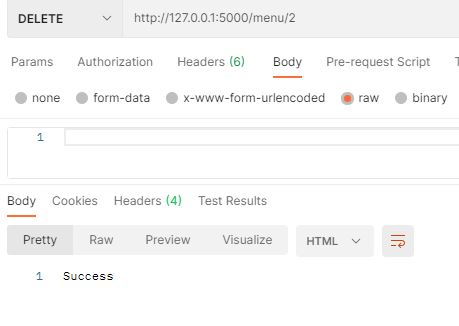

# Day 1 - Flask를 Flask 답게

실습에서는 `GET` 과 `POST` 를 이용해서 `/menu` 자원으로부터 데이터를 가지고오고, 자원에 데이터를 추가해보았습니다. 이는 자원에서 할 수 있는 4가지 logic인 CRUD(Create, Read, Update, Delete) 중 Create와 Read에 해당하는 부분입니다. 이를 바탕으로 다음 과제를 해결해봅시다.

### 필수 과제 : 메뉴 관리 CRUD 구현하기

- HTTP 메서드 `PUT` 를 이용해 Update, `DELETE` 를 이용해 Delete 기능을 구현해주세요.
- `PUT /menu/<int:id>` : 해당하는 id에 해당하는 데이터를 갱신합니다. (HTTPRequest으로 Body가 주어집니다.)
- `DELETE /menu/<int:id>` : 해당하는 id에 해당하는 데이터를 삭제합니다.
- `@app.route()` 의 인자로 들어가는 경로에는 다음과 같이 사용해줄 수도 있습니다.

```python
@app.route('/<name>') # URL에 <>를 붙임으로서 이를 함수의 인자로 대입할 수 있습니다.
def my_view_func(name):
    return name
```

### 보너스 과제 I: ID야 움직여라 얍!

- 새로운 menu를 추가하는 `POST` 영역에서 id가 4로 고정되어있는 문제가 발생합니다.
- POST 요청이 들어올 때마다 id가 하나씩 증가하여 `menu` 리스트에 추가될 수 있도록 코드를 수정해주세요.
- 이 과제는 필수 과제 이후에 진행되어야 합니다.

### 보너스 과제 II : 데이터베이스 연동하기

- 수업에서 다룬 API는 서버를 재시작하면 모든 정보가 리셋되는 치명적인 문제가 있었습니다. 이를 해결하기 위해 데이터만을 저장하는 **데이터베이스**를 도입하여 Flask과 연동할 필요가 생겼습니다.
- SQL과 ORM 중 하나를 선택하여 데이터베이스와 Flask app을 연동해봅시다. (즉, 자원에 CRUD가 발생하면 이 정보가 데이터베이스에 저장되어야합니다.)
- 이 과제는 필수 과제, 보너스 과제 I 이후에 진행되어야 합니다.

## **ScreenShot**

1. MYSQL menus 테이블 정보


2. POST를 통해 데이터를 추가 후 결과


3. POST를 통해 데이터를 추가 후 GET을 통해 확인


4. 이후 데이터베이스 조회를 통해 menus 상태 확인


5. PUT 존재하는 ID가 주어진 경우


6. PUT 존재하지 않는 ID가 주어진 경우


7. GET을 통해 PUT 결과 확인


8. DELETE 존재하는 ID가 주어진 경우



9. DELETE 존재하지 않는 ID가 주어진 경우


10. GET을 통해 DELETE 결과 확인


