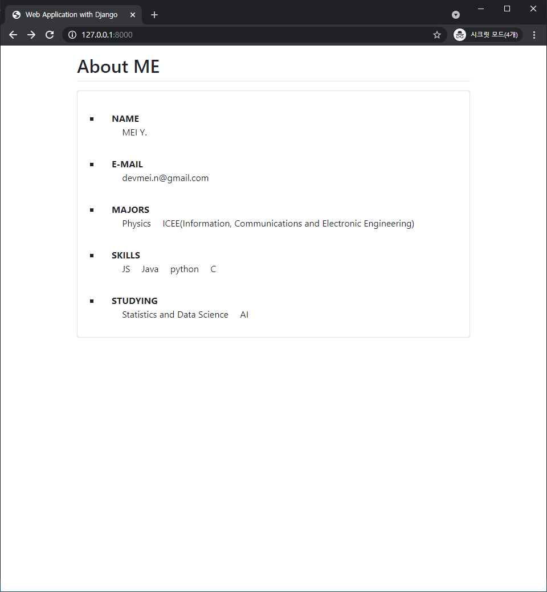
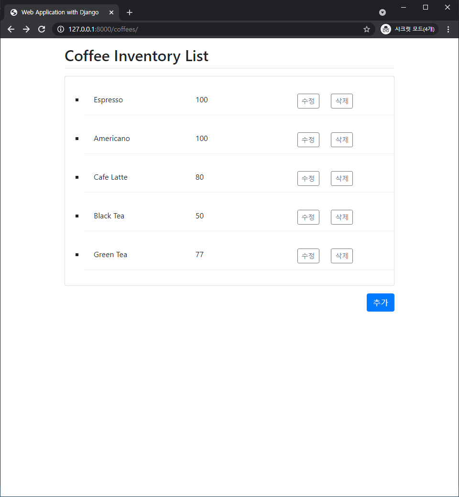
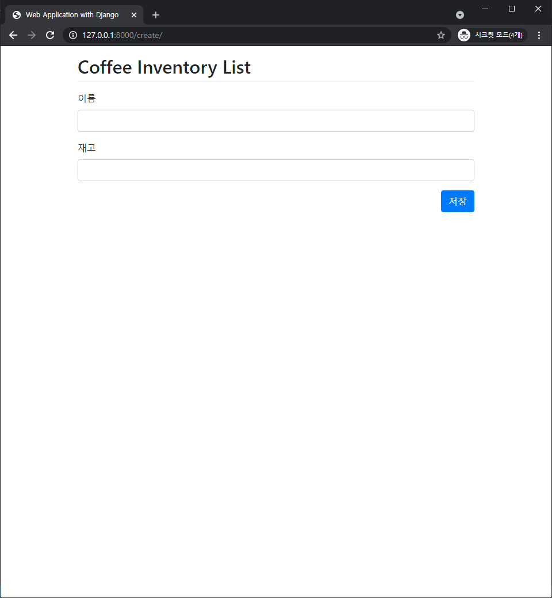
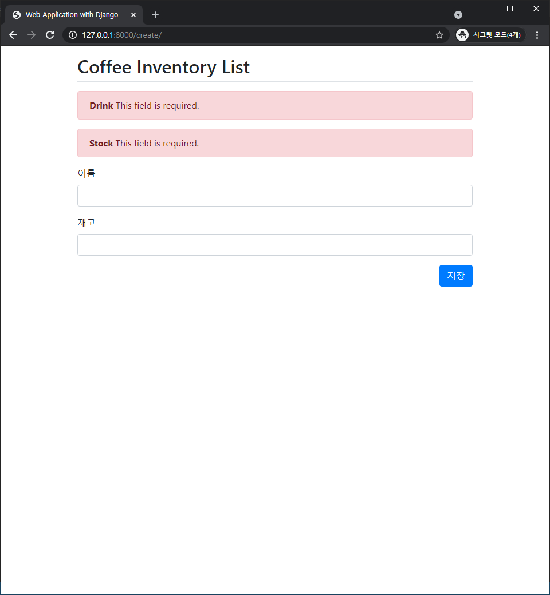
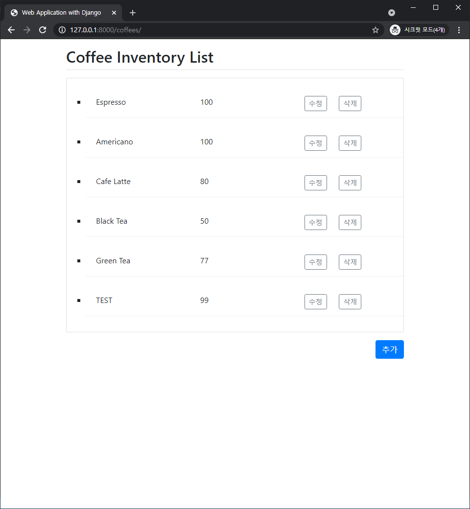
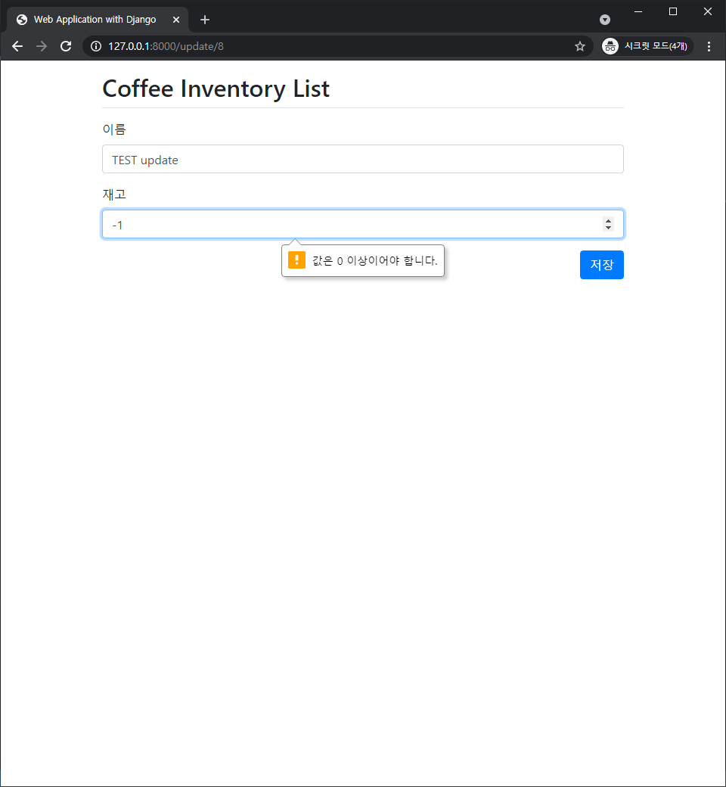
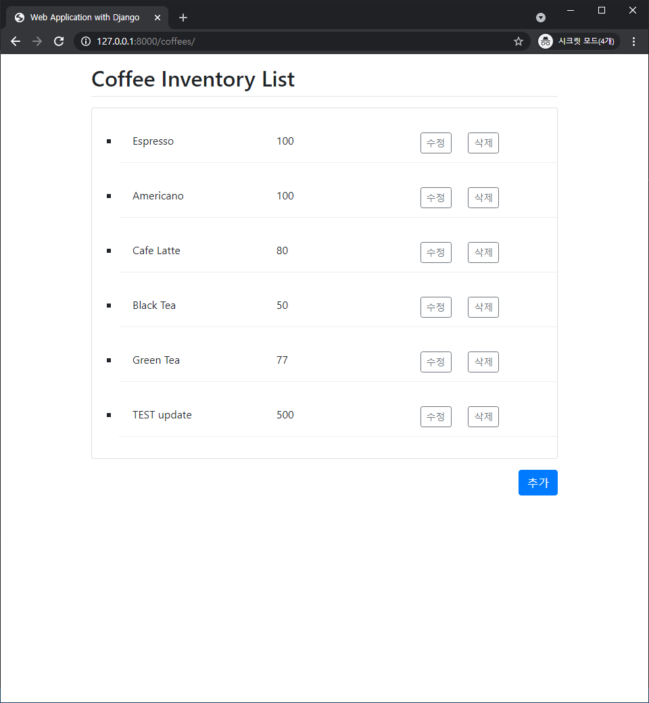
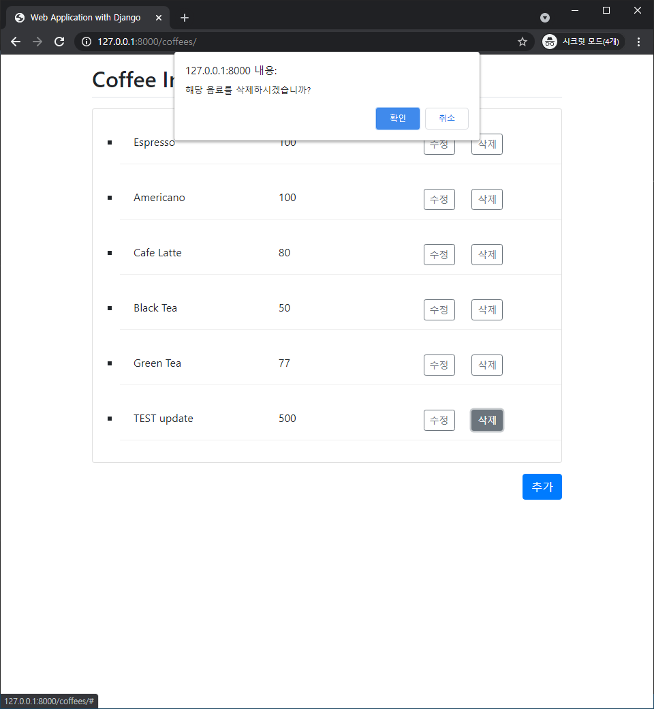

# Day 2 - Django로 동적 웹 페이지 만들기

### 필수 과제 : 재고 관리 List 구현하기

- 다음 요청을 처리하는 웹 애플리케이션을 제작해주세요.
- `GET /` : Day 1에서 만든 자기소개 웹 페이지를 Response
- django를 바탕으로 재고 관리를 진행하는 Website를 만들고자 합니다.
    1. 재고관리를 하고자 하는 대상을 하나 정해주세요. (coffee, burger, )
    2. 이 대상에게 맞는 Database Scheme를 model로 하여 `model.py`에 작성합니다. 
    아래 예시에서는 coffee 재고 관리 시스템이라는 가정하에 서술합니다.
    3. 이를 바탕으로 다음 기능을 구현해주세요.
        - `GET /coffees` : 커피 목록을 *unordered list*로 보여주기

### 보너스 과제 : form을 이용해서 CUD구현하기

HTML의 `form` 을 이용해서 우리는 정보를 클라이언트 단에서 서버 단으로 전달할 수 있는데요, 이 정보를 바탕으로 다음 기능을 admin page가 아닌, `/coffees` 페이지에서 진행할 수 있도록 만들어봅시다.

다음 기능을 구현해주세요. 필수 과제 부분을 완성한 후에 구현하셔야 합니다.

- `POST /coffees` : 새로운 커피를 추가
- `PUT /coffees/<pk>` : 해당하는 커피의 정보를 변경
- `DELETE /coffees/<pk>` : Primary Key 값에 해당하는 커피를 제거
- `POST`, `PUT`, `DELETE`를 진행하고 난 후에는 커피 목록을 *unordered list*로 보여주기
- `redirect()` 함수가 필요할 수 있습니다. 이는 인자에 해당하는 URL로 이동합니다. (그에 해당하는 views가 실행될 수도 있습니다.)

## **과제 결과** - screen shot

- ### `GET /`
    - Day 1에서 만든 자기소개 웹 페이지

  

- ### `GET /coffees`
    - 음료 목록을 *unordered list*로 출력

  

- ### `POST /coffees`
    - `추가` 버튼을 클릭하여 새 음료 추가
    - 이름(`drink`) 또는 재고(`stock`) 값이 없으면 오류 메시지 출력
    - 테스트 데이터로 '*TEST*' 이름을 가진 음료 *99*개(잔) 추가

   

  

- ### `PUT /coffees/<pk>`
    - `수정` 버튼을 클릭하여 음료의 이름 또는 재고 정보 변경
    - 재고(`stock`)의 경우 `input`에 `min=0` 옵션 부여
        - 음수 입력 시 **0 이상의 값을 입력**하라는 경고문 출력
    - 'TEST' 음료의 이름을 '*TEST update*', 99개의 재고는 *500*개로 수정

   

  

- ### `DELETE /coffees/<pk>`
    - `삭제` 버튼을 클릭하여 음료 삭제
    - 삭제 전 `alert`를 띄워 삭제 여부를 한 번 더 확인
        - `확인`을 누른 경우 **삭제**
        - `취소`를 누른 경우 **삭제하지 않음**
    - 테스트 데이터인 '*TEST update*' 정보 삭제 완료

   

