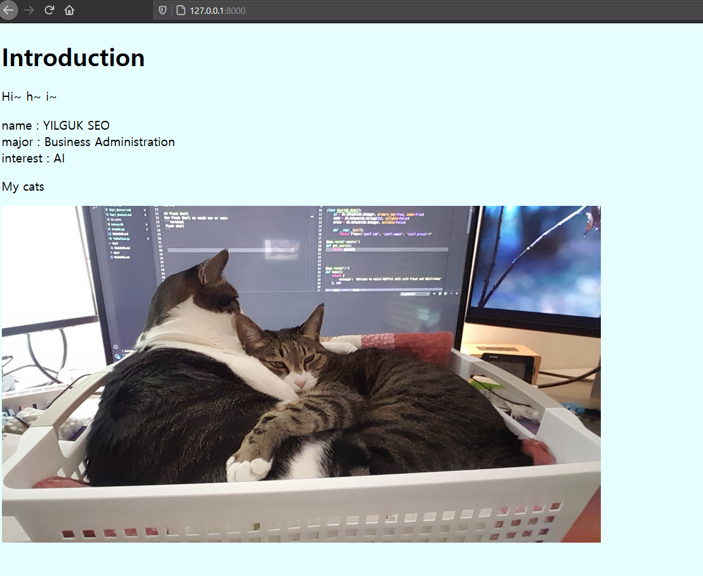

# Day 3 - Django로 자기소개 페이지 만들기

### 필수 과제 : 아이엠 그라운드 자기소개 하기

### 보너스 과제 : ⭐️아이😊엠 그라운드⛳️ 자기💁‍♀️소개💁‍♂️ 하기⭐️

  

Static으로 css background color 적용 & img 추가  

다음엔 bootstrap으로

hide secret key  
<https://dev.to/vladyslavnua/how-to-protect-your-django-secret-and-oauth-keys-53fl>