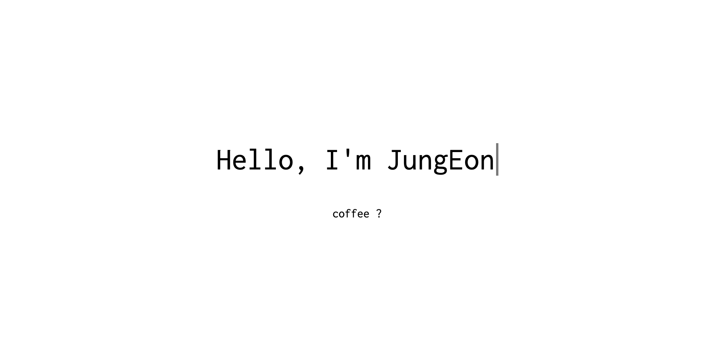
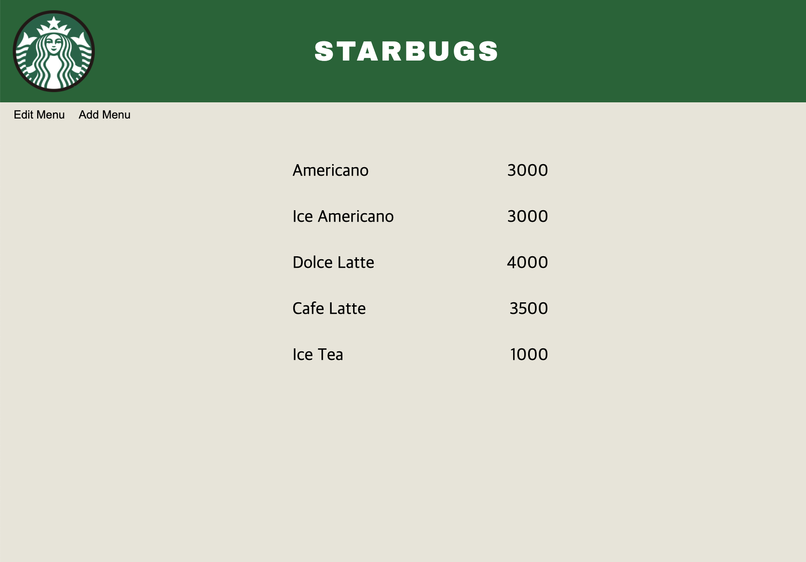
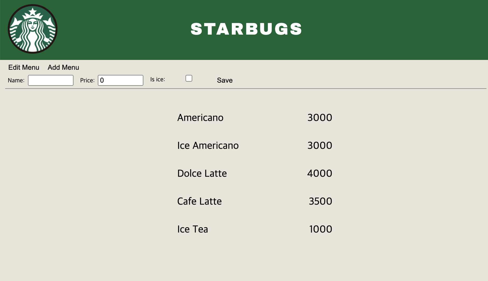
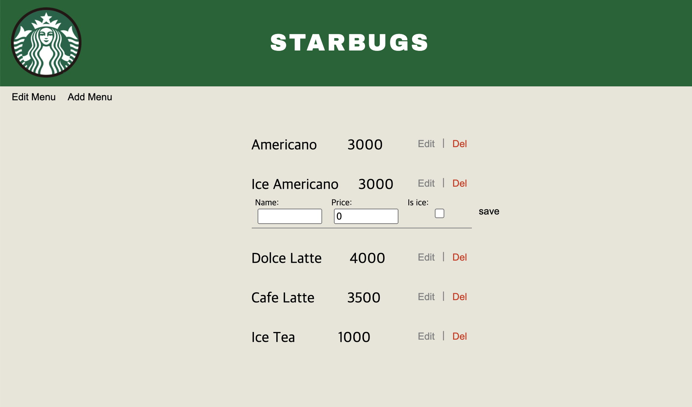

## My Coffee Shop
It's for practice of 'Django + CRUD'.
     

👆 This is the opening page.
     

👆 This is the main page. 
     

👆 If you click the __'Add Menu'__ button at the top left, a form to add a menu is displayed.
     

👆 If you click the __'Edit Menu'__ button in the upper left corner, a button to edit or delete a menu will appear.