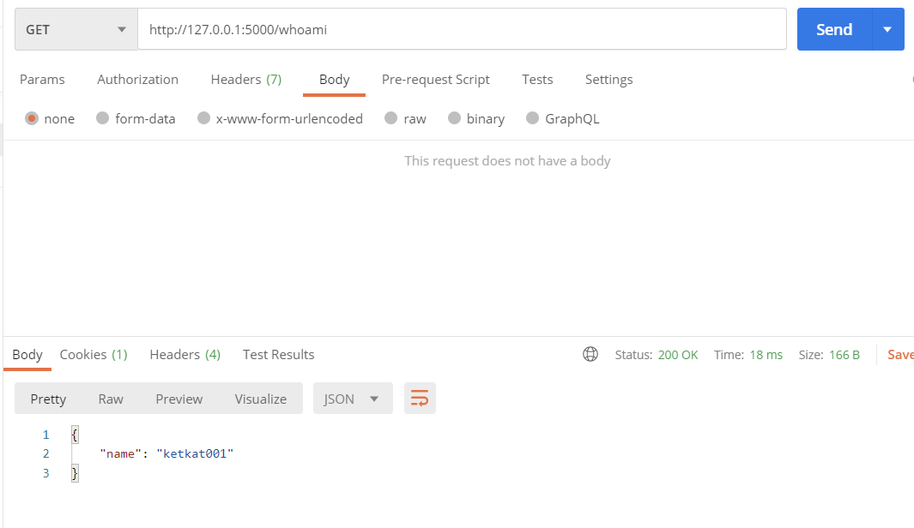
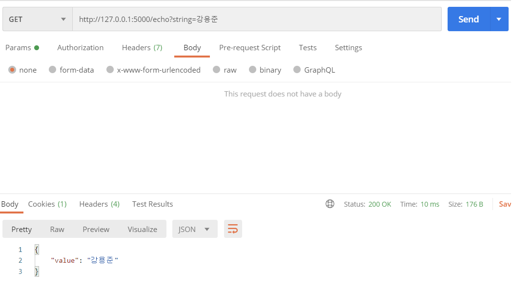
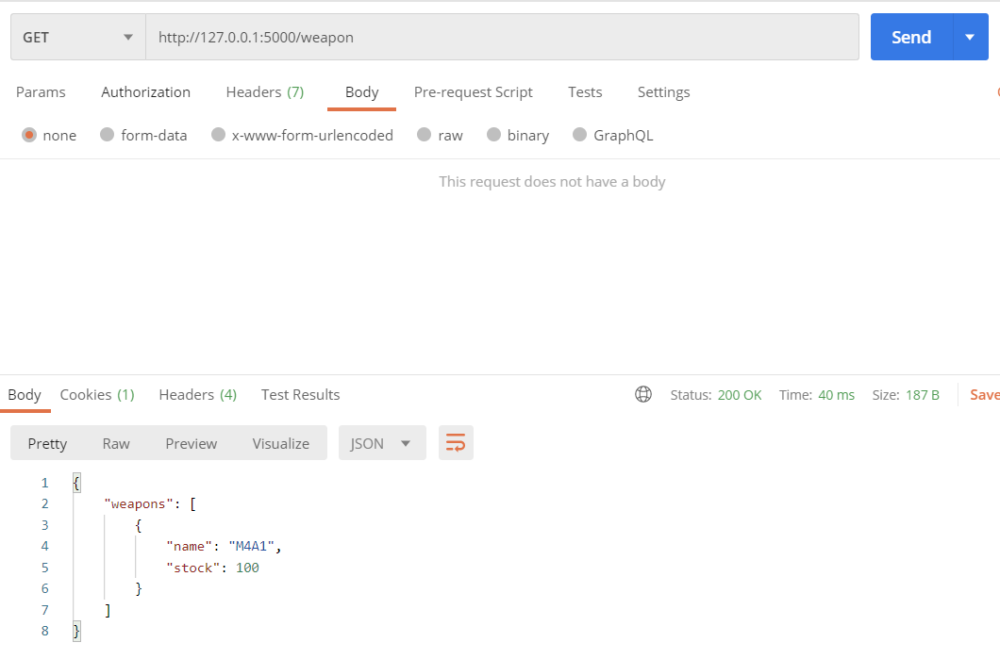
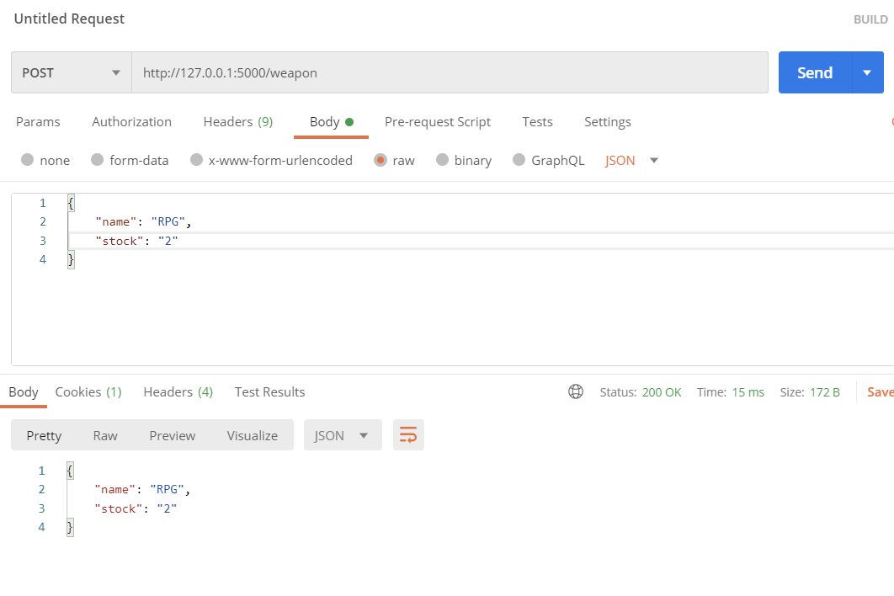
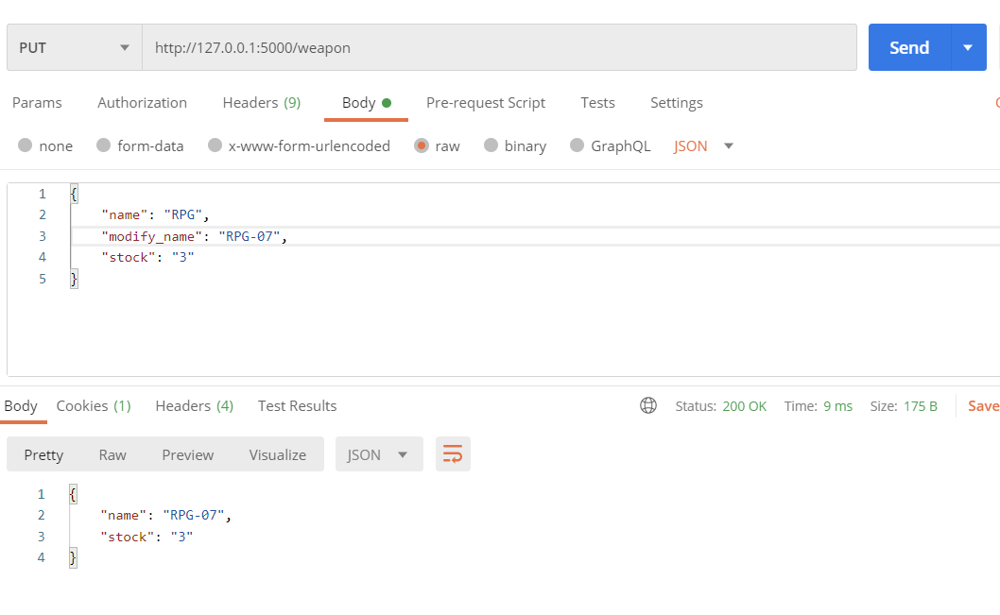
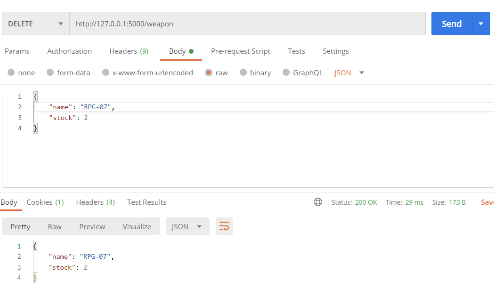

## Bicsubi CORE API Docs

### Bicsubi Basic API

### `` GET / whoami`` 

- 본인의 github id를 반환합니다.

- result:

  

  

### ``GET / echo?string="string"``

- Query String : String

- string을 반환합니다

- result :

  

### Bicsubi Weapon API(CRUD)

### ``GET / weapon``

- READ: 현재 데이터베이스에 존재하는 모든 **weapon**을 확인

- url = http://127.0.0.1:5000/weapon

- result 

  

### ``POST / weapon``

- CREATE : 새로운 **weapon**의 정보 (name, stock)를 데이터베이스에 추가

- url : http://127.0.0.1:5000/weapon

- body에 포함시켜야 하는 데이터 : name, stock

- result

  

### ``PUT / weapon``

- UPDATE : 데이터베이스에 존재하는 **weapon**에서 정보(name, stock)를 수정

- url : http://127.0.0.1:5000/weapon

- body에 포함 시켜야 하는 데이터 : name, modify_name, stock

- result 

  

### ``DELETE / weapon``

- DELETE : 데이터베이스에 존재하는 **weapon** 데이터를 삭제
- url : http://127.0.0.1:5000/weapon
- body에 포함시켜야 하는 데이터 : name, stock

- result

  

  

