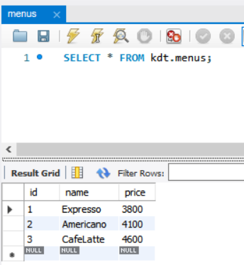
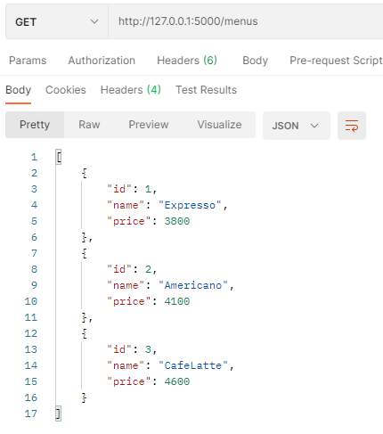
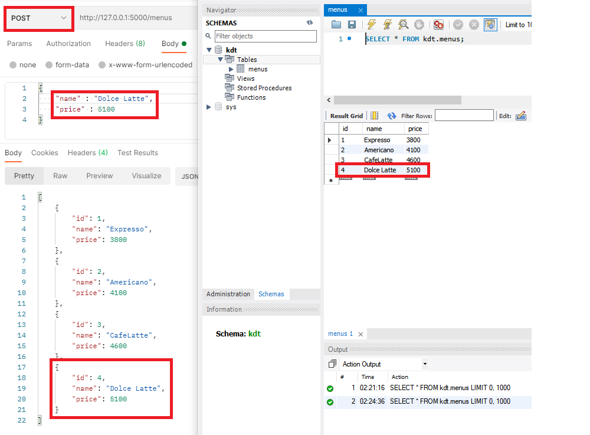
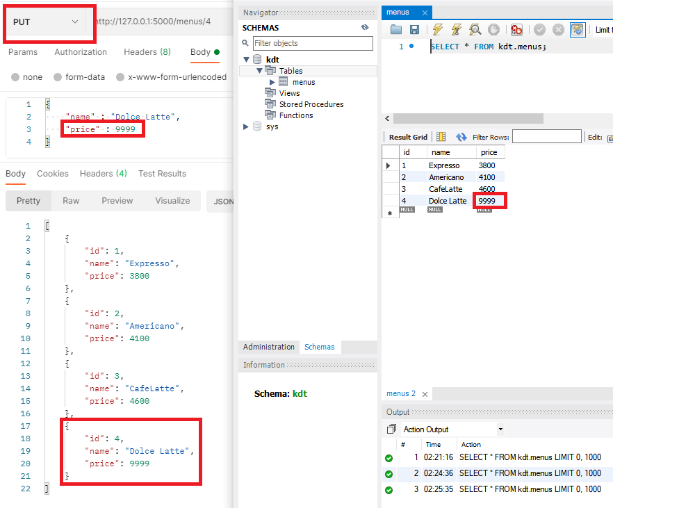
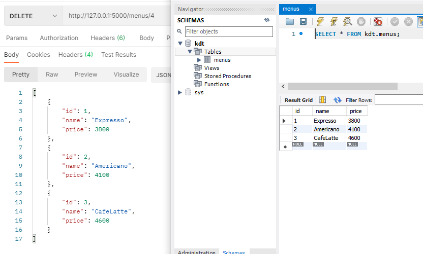

# Day 1 - Flask를 Flask 답게

<br>

# 필수 과제 : 메뉴 관리 CRUD 구현하기

Q) HTTP 메서드 `PUT` 를 이용해 Update, `DELETE` 를 이용해 Delete 기능을 구현해주세요.  
`PUT /menu/<int:id>` : 해당하는 id에 해당하는 데이터를 갱신합니다. (HTTPRequest으로 Body가 주어집니다.)  
`DELETE /menu/<int:id>` : 해당하는 id에 해당하는 데이터를 삭제합니다.  
`@app.route()` 의 인자로 들어가는 경로에는 다음과 같이 사용해줄 수도 있습니다.  

```python
@app.route('/<name>') # URL에 <>를 붙임으로서 이를 함수의 인자로 대입할 수 있습니다.
def my_view_func(name):
    return name
```

<br>

#### A) HTTP 메서드 `PUT` 를 이용해 Update 기능 구현
1. `<int:id>`로 들어오는 `id`을 `update_menu()`의 인자로 넘겨준다.
2. `request_data`에 body에 있는 JSON정보를 저장하고
3. `menus`를 for문으로 `menu['id']`와 `id`이 같은 행을 찾는다.
4. 찾은 행의 정보를 `request_data`의 정보로 `Update`해준다.

<br>

``` python
# PUT /menus/<int:id> | 자료를 자원에서 수정한다.
@app.route('/menus/<int:id>', methods=['PUT'])
def update_menu(id):
    request_data = request.get_json()

    for menu in menus:
        if menu['id'] == id:
            menu['name'] = request_data['name']
            menu['price'] = request_data['price']
            return jsonify(menu)
    
    # exception 조건을 만들어주는 것이 좋다.
    return jsonify({'Error_msg' : '해당 자료가 존재하지 않습니다!'})
```
<br><br><br>

#### A) HTTP 메서드 `DELETE` 를 이용해 Delete 기능 구현  
1. `<int:id>`로 들어오는 `id`을 `delete_menu()`의 인자로 넘겨준다.
2. `menus`를 for문으로 `menu['id']`와 `id`가 같은 행을 찾는다.
    * 이때, `enumerate()`를 이용하는데 찾은 행을 `pop` 해주기위함이다.  
    (`id값`과 `행의 차례의 값`이 다를 수 있기 때문에)
<br>

``` python 
# DELETE /menus/<int:id> | 자료를 자원에서 삭제한다.
@app.route('/menus/<int:id>', methods=['DELETE'])
def delete_menu(id):
    for i, menu in enumerate(menus):
        if menu['id'] == id:
            return jsonify(menus.pop(i))
    
    # exception 조건을 만들어주는 것이 좋다.
    return jsonify({'Error_msg' : '해당 자료가 존재하지 않습니다!'})
```


<br><br><br>

<hr>

# 보너스 과제 I: ID야 움직여라 얍!
<br>

#### Q) POST 요청이 들어올 때마다 `id가 하나씩 증가`하여 `menu` 리스트에 추가될 수 있도록 코드를 수정해주세요.
#### A) POST 요청 시 id값을 `len(menus)+1`로 넣어준다.  

<br>

``` python
# POST /menus | 자료를 자원에 추가한다.
# POST, PUT, DELETE 등 method인자로 넣겨줘야한다.
@app.route('/menus', methods=['POST'])
def create_menu():  # request가 JSON이라고 가정
    # 전달받은 자료를 menus 자원에 추가
    request_data = request.get_json()  # {'name' : ..., 'price':...}
    new_menu = {
        'id' : len(menus)+1,
        'name' : request_data['name'],
        'price' : request_data['price']
    }

    menus.append(new_menu)
    return jsonify(new_menu)
```

<br><br><br>

<hr>

# 보너스 과제 II : 데이터베이스 연동하기
#### Q) SQL과 ORM 중 하나를 선택하여 데이터베이스와 Flask app을 연동해봅시다. (즉, 자원에 CRUD가 발생하면 이 정보가 데이터베이스에 저장되어야합니다.)

#### 1. Mysql 설치
> https://m.blog.naver.com/bjh7007/221829548634

<br><br>

#### 2. Mysql에 menus table 생성
<br>

``` sql
# table의 집합인 스키마 생성
CREATE SCHEMA <스키마 이름> ;

# 테이블 생성
CREATE TABLE <테이블 이름> (
  <속성 이름> <타입> <Default값>);
```

이 때, id 값을 `AUTO_INCREMENT` 기능을 사용해서 데이터를 추가할 때마다 자동으로 숫자가 증가하게 할 수있다.
하지만 필자는 다른 방식으로 진행했다. (밑에서 설명)

<br><br>

#### 3. menus table에 데이터 Insert 하기
<br>

``` sql
# menus 테이블 생성
CREATE TABLE meanus (
  `id` INT NULL,
  `name` VARCHAR(45) NULL,
  `price` INT NULL);

# 정보 Insert
INSERT INTO menus 
    (`id`, `name`, `price`)
VALUES 
    (1, 'Expresso', 3800),
    (2, 'Americano', 4100),
    (3, 'CafeLatte', 4600);
```
<br><br>

#### 4. flask와 mysql 연동
<br>

+) 연동을 위해 `pymysql` 모듈 설치 필요
```
pip install pymysql
```

``` python
import pymysql

# DB 연동하기
# 스키마 이름 : kdt, 테이블 이름 : menus
db = pymysql.connect(host="localhost", port=3306, user="root", password="******", db="kdt")
# DictCursor가 아닌 일반 Cursor를 사용하면 결과가 튜플 형태로 리턴된다.
cursor = db.cursor(pymysql.cursors.DictCursor)
```
<br>




<br><br>

#### GET 구현
<br>

``` python
# GET /menus | 자료를 가지고 온다.
@app.route("/menus")
def get_menus():
    # sql 실행
    cursor.execute("SELECT * FROM menus")
    # 해당 조회 데이터를 다 호출해 가져온다.
    return jsonify(cursor.fetchall())

```
<br>



<br><br>

#### POST 구현
<br>

``` python
# POST /menus | 자료를 자원에 추가한다.
@app.route("/menus", methods=["POST"])
def create_menu():
    request_data = request.get_json()

    sql = """
        INSERT INTO menus 
                    (`id`, `name`, `price`)
                VALUES 
                    ((SELECT IFNULL(MAX(id) + 1, 1) from menus m), %s, %s)
        """
    cursor.execute(sql, (request_data['name'], request_data['price']))
    db.commit()
    cursor.execute("SELECT * FROM menus")
    return jsonify(cursor.fetchall())
```
<br>

> 위에서 한번 언급을 했는데 id를 `AUTO_INCREMENT` 기능을 사용해서 데이터를 추가할 때마다 자동으로 숫자가 증가하게 할 수도 있지만, 이는 {1, 2, 3, 4, 5, 6}의 테이블에서 {5, 6}번을 삭제 후 `Insert`를 진행하면 {1, 2, 3, 4, 7}로 데이터가 넣어지는 문제점이 있다.  
(이 부분은 초기화 해주는 코드로 해결 가능)  
이 문제를 해결하기 위해 필자는 테이블의 max(id)+1을 넣어주는 방식으로 id값을 증가해주었다 (서브 쿼리)
>>(SELECT IFNULL(MAX(id) + 1, 1) from menus m)  
menus 테이블의 id 속성에서 MAX(id) +1의 값을 반환하는데, IFNULL()의 명령어로 인해 MAX(id)+1이 NULL 값이면 1을 반환하라는 의미이다.(맨 처음 데이터를 넣을 때는 MAX(id)=NULL)

<br>



<br><br>

#### PUT 구현
<br>

``` python
# PUT /menus/<int:id> | 자료를 자원에서 수정한다.
@app.route("/menus/<int:id>", methods=["PUT"])
def update_menu(id):
    request_data = request.get_json()

    sql = """
        UPDATE menus SET name=%s, price=%s
        WHERE id=%s
        """
    cursor.execute(sql, (request_data['name'], request_data['price'], id))
    db.commit()
    cursor.execute("SELECT * FROM menus")
    return jsonify(cursor.fetchall())
```
<br>



<br><br>

#### DELETE 구현
<br>

``` python
# DELETE /menus/<int:id> | 자료를 자원에서 삭제한다.
@app.route("/menus/<int:id>", methods=["DELETE"])
def delete_menu(id):
    sql = """
        DELETE FROM menus WHERE id=%s
        """
    cursor.execute(sql, (id))
    db.commit()
    cursor.execute("SELECT * FROM menus")
    return jsonify(cursor.fetchall())
```
<br>



<br><br>

>[참고]
- [mysql workbench](https://m.blog.naver.com/PostView.nhn?blogId=tipsware&logNo=221304314735&proxyReferer=https:%2F%2Fwww.google.com%2F)
- [Python으로 MySQL 사용하기 - PyMySQL 라이브러리](https://yurimkoo.github.io/python/2019/09/14/connect-db-with-python.html)
- [[Flask] PyMySQL을 이용해서 MySQL 사용하기](https://velog.io/@kho5420/Flask-PyMySQL%EC%9D%84-%EC%9D%B4%EC%9A%A9%ED%95%B4%EC%84%9C-MySQL-%EC%82%AC%EC%9A%A9%ED%95%98%EA%B8%B0)
