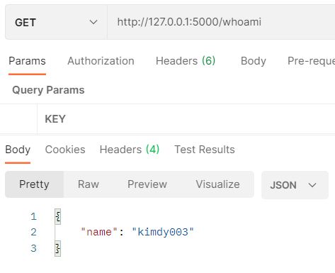
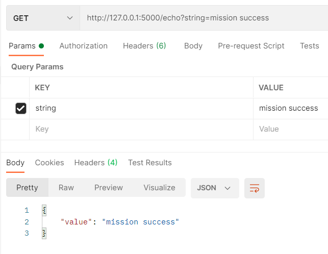
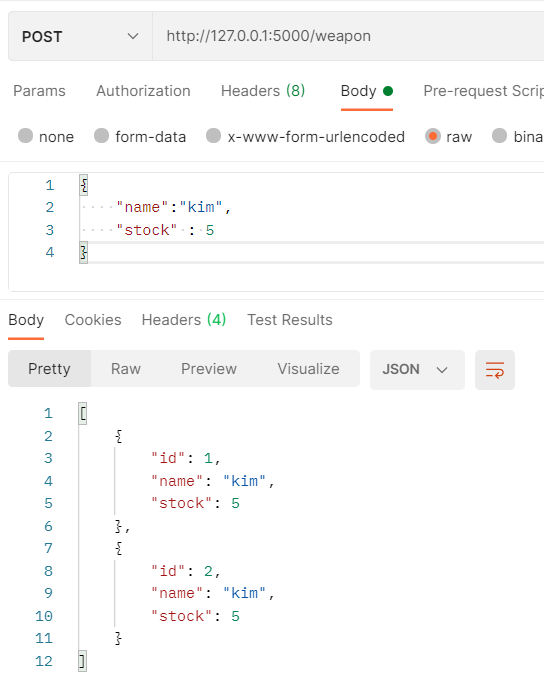
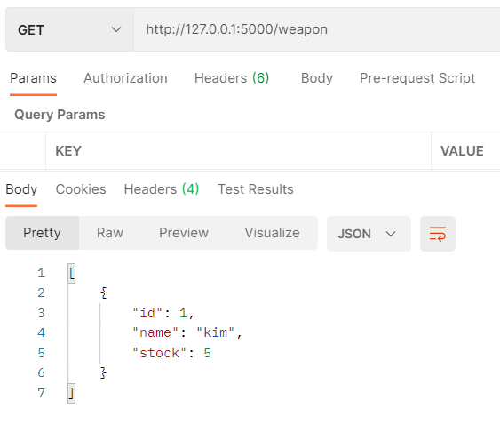
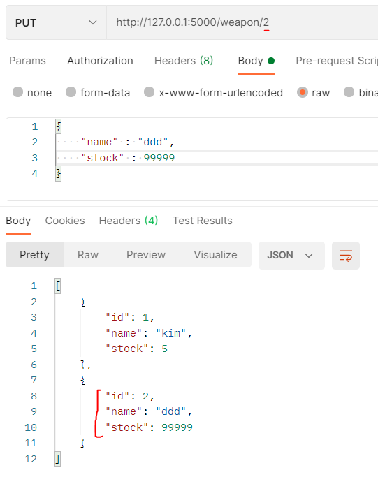
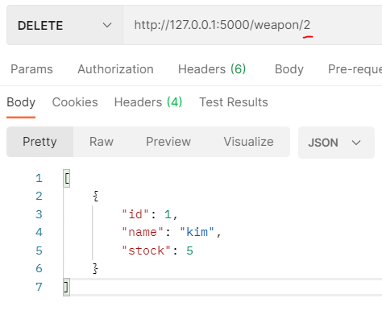

# **Mission 1. My New Assistant**

# **core Mission**

## `GET /whoami`
``` python
@app.route('/whoami')
def whoami():
    return jsonify({'name':'kimdy003'})
```
<br>



<br><br>

## `GET /echo?string="string`
``` python
@app.route('/echo')
def query_string():
    return jsonify({'value' : request.args.get('string')})
```
<br>



<br><br>

## `Create` : 새로운 weapon 을 추가
``` python
@app.route('/weapon', methods=['POST'])
def create_weapon():
    request_data = request.get_json()

    sql = """
        INSERT INTO weapons 
                    (`id`, `name`, `stock`)
                VALUES 
                    ((SELECT IFNULL(MAX(id) + 1, 1) from weapons m), %s, %s)
    """
    cursor.execute(sql, (request_data['name'], request_data['stock']))
    db.commit()
    cursor.execute("SELECT * FROM weapons")
    return jsonify(cursor.fetchall())
```
<br>



<br><br>

## `Read` : 현재 존재하는 weapon 을 확인
``` python
@app.route('/weapon')
def get_weapons():
    cursor.execute("SELECT * FROM weapons")
    return jsonify(cursor.fetchall())
```
<br>



<br><br>

## `Update` : 현재 존재하는 weapon 에서 특정 속성(이름, 수량)을 변경
``` python
@app.route('/weapon/<int:weapon_id>', methods=['PUT'])
def update_weapon(weapon_id):
    request_data = request.get_json()

    sql = """
        UPDATE weapons SET name=%s, stock=%s
        WHERE id=%s
    """
    cursor.execute(sql, (request_data['name'], request_data['stock'], weapon_id))
    db.commit()
    cursor.execute("SELECT * FROM weapons")
    return jsonify(cursor.fetchall())
```
<br>



<br><br>

## `Delete` : 현재 존재하는 특정 weapon 을 삭제
``` python
@app.route('/weapon/<int:weapon_id>', methods=['DELETE'])
def del_weapon(weapon_id):
    sql = '''
        DELETE FROM weapons 
        WHERE id=%s
    '''
    cursor.execute(sql, (weapon_id))
    db.commit()
    cursor.execute("SELECT * FROM weapons")
    return jsonify(cursor.fetchall())
```
<br>



<br><br>